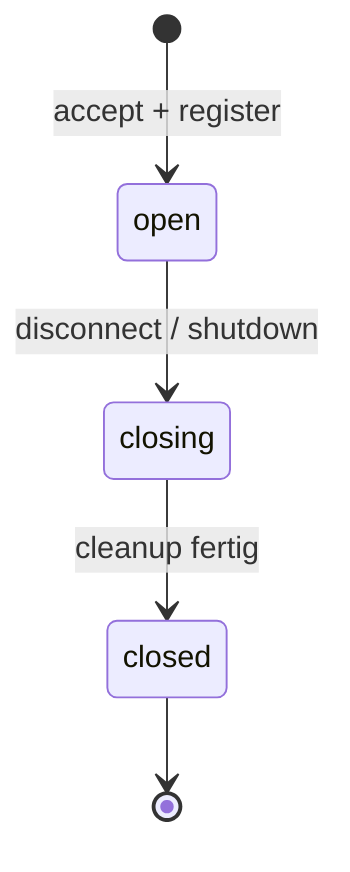
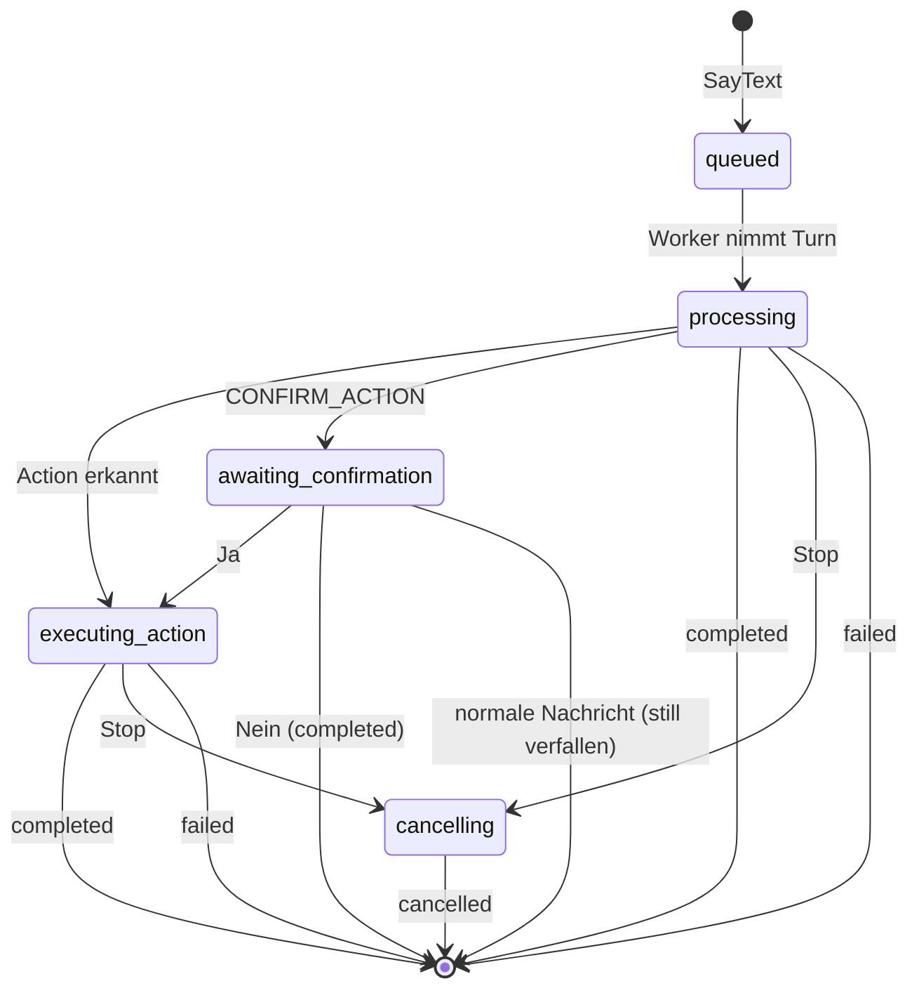

# RFC-0006 — Explicit Conversation, Voice and Job State Models

- **Status:** Accepted for incremental implementation — **inkl. [Amendment 1](#amendment-1--vervollständigtes-zustandsinventar)**
- **Datum:** 2026-07-18 (Proposed); 2026-07-18 (Accepted nach ausdrücklicher Nutzerfreigabe);
  2026-07-18 (Amendment 1 nach Compliance-Audit, ausdrücklich freigegeben)
- **Autor:** Masterplan Prompt 16 (Phase 4I), Architektur-only
- **Basis:** `origin/master` `31b3f795810db1095f48953be622af9b881839fc` (regulärer Merge von PR #8, RFC-0005);
  Post-Merge-Hosted-Run **29639177233** (`workflow_dispatch`, Fast + Browser success)
- **Nachfolge-Umsetzung:** Prompt 17 (Phase 4J) — **dieser RFC implementiert nichts**
- **Bezug:** RFC-0001 (Action deep module), RFC-0002 (Composition Root, **K03 offen**),
  RFC-0003 (Versioned Configuration), RFC-0004 (Structured Operational Logging),
  RFC-0005 (Typed and Versioned Wire Contracts, implementiert)

> **Dieser RFC ist reine Architektur.** Er ändert keinen Produktionscode, keine Tests, keine
> Workflows und keine Dependencies. Er inventarisiert den heute **impliziten** Laufzeitzustand,
> vergleicht Architekturvarianten und legt die Entscheidungen D1–D13 fest. **Es wurde keine
> State Machine implementiert.** Die Produktion nutzt weiterhin verstreute Flags, Modul-Dicts
> und `asyncio.Task`-Zustände; die Umsetzung beginnt erst mit Prompt 17.

> **Amendment 1 (2026-07-18) ist Bestandteil dieses RFC.** Ein nachgeholter Skill-Compliance-Audit
> (Prompt 16F) fand das **Zustandsinventar in §2.2 an drei Stellen unvollständig**. Amendment 1
> ergänzt den Playback-Zustand `locked`, den verbindungsübergreifenden **Greeting-Latch** und den
> **vollständigen Geltungsbereich des Epoch-Guards**. Die Architekturentscheidungen D1–D14 und die
> öffentliche Interface (§24) bleiben **unverändert**. Wo §2.2, §12, §13, §15.3, §16 oder §21 vom
> Amendment abweichen, **gilt Amendment 1**.

---

## 1. Kontext und Problem

Jarvis hat heute **keinen explizit modellierten Laufzeitzustand**. Was der Assistent gerade tut,
ergibt sich aus dem Zusammenspiel von:

- zwei Modul-Dicts in `assistant_core` (`conversations`, `pending_confirm`),
- drei endpunktlokalen Variablen (`queue`, `state["task"]`, `state["stopping"]`),
- rund zehn Browser-Globals (`uiState.jarvisState`, `isMuted`, `uiState.micMuted`, `isPlaying`,
  `audioQueue`, `currentAudio`, `isListening`, `recognition`, `micMode`, `reconnectAttempts`),
- **dem DOM selbst** (`action-running` wird aus Textinhalt abgeleitet) und
- **Timern** (`flashOrbError`-Revert, `resumeListening`).

Daraus folgen drei konkrete Probleme:

1. **Falsche Autorität.** Ein einziger visueller Zustandswert (`jarvisState`) behauptet, den
   Gesamtzustand zu kennen — aber nur der Browser weiß, ob Audio tatsächlich läuft, und nur der
   Server kennt Queue und Confirmation.
2. **Kollabierte Orthogonalität.** `muted` (Capture-Modifikator), `degraded`/`error` (Overlays)
   und `disconnected` (Verbindung) teilen sich den Werteraum mit echten Lifecycle-Zuständen.
   Kombinationen wie „stumm **und** sprechend" sind nicht darstellbar.
3. **Unkontrollierte Races.** Asynchrone Recognition-, Audio-, Timer-, WS- und Stop-Callbacks
   treffen in beliebiger Reihenfolge ein. Es gibt keine systematische Regel, welcher Callback
   veraltet ist — der letzte Schreiber gewinnt.

Der Masterplan-Punkt „Conversation-, Voice- und Jobzustände explizit modellieren" ist der letzte
offene Punkt der Phase 4. Erst danach beginnt Phase 5 (Capability-/Policy-Kernel).

---

## 2. Ist-State-Inventar (beweisgestützt)

Alle Angaben aus dem Code auf Basis `31b3f79`.

### 2.1 Backend — Conversation

| Fakt | Beleg |
|---|---|
| Verlauf ist ein Modul-Dict | `assistant_core.py:55` `conversations: dict[str, list] = {}` |
| Offene Confirmation ist ein **getrenntes** Modul-Dict | `assistant_core.py:56` `pending_confirm: dict[str, actions.Action] = {}` |
| Beide werden von der Runtime **aliasiert** (kein echter Besitz) | `runtime.py:64-65` + `runtime.py:131-132` `assistant_core.conversations = self.conversations` |
| Queue, aktueller Child-Task und `stopping` leben **lokal im WS-Endpunkt** | `server.py:137-138` `queue = asyncio.Queue()`, `state = {"task": None, "stopping": False}` |
| Genau **ein** Worker pro Session, strikt sequenziell | `server.py:140-168`, `worker_task = asyncio.create_task(worker())` |
| Correlation ist **pro Command** gebunden | `server.py:143` `sink = channel.event_sink(cmd.correlation_id)` |
| Stop cancelt Task, leert Queue, verwirft Confirmation, sendet StopAck | `server.py:206-220` |
| **StopAck wird VOR Abschluss der Cancellation gesendet** | `server.py:211` `task.cancel()` → `:216` `await channel.emit(wp.StopAck(...))`; **kein** `await task` dazwischen |
| Disconnect setzt `stopping`, cancelt Worker, unregistriert Channel, beendet Session | `server.py:234-239` |
| Fehler werden zu Events und danach **implizit** in Bereitschaft zurückgeführt | `server.py:158-166` (`except Exception` → `send_error` → `finally: state["task"] = None`) |
| „Ready" ist kein Zustand, sondern `state["task"] is None` | `server.py:166` |
| `pending_confirm` wird von **zwei** Tasks manipuliert | Worker: `assistant_core.py:405`; Receive-Loop: `server.py:214` |
| Eine normale Nachricht während Confirmation lässt diese **still verfallen** | `assistant_core.py:405` (pop **vor** der Verdict-Prüfung) + `:406-416` |
| **Kein Timeout** auf Confirmations | kein Timer im gesamten Confirmation-Pfad |
| Transportzustand liegt bei RFC-0005, **nicht** der Conversation-Zustand | `ConversationChannel`/`ConnectionRegistry` besitzen `session_id` + Send-Lock, nicht Queue/Verlauf/Confirmation |

### 2.2 Frontend — Voice

| Fakt | Beleg |
|---|---|
| Ein einziger visueller Zustandswert | `main.js:37` `uiState = { connected, micMuted, jarvisState, lastError, warnings }` |
| Enum hat 6 Werte … | `main.js:41-44` `STATE_WORDS = {idle, listening, thinking, speaking, muted, error}` |
| … aber nur **4** werden je direkt gesetzt | `setOrbState('idle'|'thinking'|'speaking'|'error')`; `listening` nur via Ternary `main.js:600`, `muted` nur **abgeleitet** `main.js:658` |
| `muted` wird in die flache Enum projiziert | `main.js:658` `const effective = (state === 'idle' && isMuted) ? 'muted' : state;` → bei `speaking` ist Mute unsichtbar |
| **Doppelte** Mute-Wahrheit, manuell gespiegelt | `main.js:27` `isMuted` + `:37` `uiState.micMuted`; Sync in `updateMuteButton()` `:686` |
| **`action-running` kommt aus dem DOM** | `main.js:667` `const actionRunning = !!document.getElementById('status-action')?.textContent;` |
| Playback-Wahrheit liegt allein im Browser | `main.js:462-507`; Autoplay-Block → Banner + `setOrbState('idle')` `:492-506`, während der Server „Audio gesendet" annimmt |
| Stale-Timer beim Wiederaufnehmen des Hörens | `main.js:610` `setTimeout(startListening, delay)` |
| Fehler ist ein **Timer-Overlay** mit gemerktem Vorzustand | `main.js:672-683` `flashOrbError()`, Revert nach 2500 ms auf `prev` |
| Vorhandene Stale-Guard (Audio) | `main.js:516-517` `currentAudio.onended = null; currentAudio.onerror = null;` in `stopPlaybackLocal()` |
| Vierte Wahrheit: Mikrofonmodus aus `localStorage` | `main.js:615` `micMode = localStorage.getItem('jarvis.micMode')` |

### 2.3 Job — Beweis der Abwesenheit

Grep über den gesamten Produktionscode (ohne `tests/`, `docs/`, `__pycache__`):

| Muster | Treffer |
|---|---|
| `sqlite3`, `aiosqlite` | **0** |
| `outbox`, `saga`, `compensat` | **0** |
| `checkpoint`, `resume` | **0** |
| `job_state`, `JobState`, `class Job` | **0** |
| `\bjob\b` / `\bJob\b` (Bezeichner) | **0** |

`assistant_core.TASKS_INFO` (`server.py:600`, `assistant_core.py:122`) stammt aus
`memory.get_tasks_sync()` — **Obsidian-Markdown-Aufgaben, read-only**. Das sind keine Jobs.
Die `asyncio.Task`-Objekte des WS-Endpunkts sind flüchtig, nicht persistiert, nicht
wiederaufnehmbar und sterben mit der Verbindung — ebenfalls **keine** Jobs.

> **Feststellung:** Es existiert heute **kein dauerhaftes Job-Aggregat und keine Job-Persistenz.**

---

## 3. State-Ownership-/Authority-Matrix (Ist)

| Zustand / Flag | Besitzer (Ist) | Produzent | Consumer | Auslöser | Erlaubte Folge | Seiteneffekte | Cleanup | Fehler-/Race-Verhalten | Testabdeckung |
|---|---|---|---|---|---|---|---|---|---|
| `conversations[sid]` | Modul-Dict (`assistant_core:55`), von `Runtime:64` aliasiert | `_remember` | LLM-Prompt (letzte 16) | jede Nachricht | append, gekappt auf `MAX_HISTORY` | — | `end_session` | Verlauf überlebt Stop; kein Turn-Bezug | indirekt (`test_conversation_ws`) |
| `pending_confirm[sid]` | Modul-Dict (`assistant_core:56`) | `process_message:453` | `process_message:405`, **`server.py:214`** | CONFIRM_ACTION | pop bei nächster Nachricht: Ja→exec, Nein→Absage, sonst **still verfallen** | Rückfrage gesprochen | `end_session` + Stop | **zwei Tasks poppen dasselbe Dict** | `test_ws::test_stop_clears_pending_confirmation`, `test_confirm_flow` |
| `queue` | lokal (`server.py:137`) | Receive-Loop | Worker | SayText | FIFO, streng sequenziell | — | Stop leert; GC bei Disconnect | Queue-Länge ist **Daten**, kein Zustand | `test_ws::test_stop_clears_queue` |
| `state["task"]` | lokales Dict (`server.py:138`) | Worker | Stop-Handler | Turn-Start | `None` ⇄ Task (implizit ready/busy) | Task-Cancel | `finally: = None` | Stop vs. Completion: `was_busy` kann veralten | `test_ws` (6 Stop-Tests) |
| `state["stopping"]` | lokales Dict (`server.py:138`) | `finally` bei Disconnect | Worker-Cancel-Pfad | Disconnect | `False`→`True` (nie zurück) | Worker-Cancel | Verbindungsende | trennt Stop- von Disconnect-Cancel (bewusst) | `test_ws::test_disconnect_cancels_running_task` |
| `session_id` | `ConversationChannel` (RFC-0005) | `connections.register` | Wire-Envelope | Accept | opake UUID, stabil je Verbindung | — | `unregister` | — | `test_wire_v1_ws` |
| `uiState.jarvisState` | Browser-Global (`main.js:37`) | `setOrbState` | Orb, Statuswort, Stop-Button | WS-Events, Audio, Recognition | flache Enum | DOM-Klassen, ARIA | — | **letzter Schreiber gewinnt**, keine Stale-Guards | Browser: `connect`, `mute`, `stop_action`, `error` |
| `isMuted` + `uiState.micMuted` | zwei Globals | Mute-Toggle | `setOrbState`, Statuszentrum | Nutzer | bool, manuell gespiegelt | Mic-Stop | — | **doppelte Wahrheit** | `flow_mute` |
| `isPlaying`/`audioQueue`/`currentAudio` | Browser-Globals | `queueAudio`/`playNext` | Orb, `resumeListening` | Audio-Frames | idle ⇄ playing | Audio-Element, ObjectURL | `stopPlaybackLocal` löst Handler ab | Autoplay-Block ⇒ Server nimmt „speaking" an, Browser ist idle | `flow_stop_action` (teilweise) |
| `isListening`/`recognition`/`micMode` | Browser-Globals + `localStorage` | SpeechRecognition | Orb, Mute, PTT | Mic-Lifecycle | idle ⇄ listening | Mic an/aus | `recognition.stop()` | `resumeListening` = `setTimeout` ⇒ **Stale-Timer** | `flow_mute`, `flow_reconnect` |
| `action-running` | **DOM-Textinhalt** | Action-Event-Handler | `setOrbState:667` | ActionLifecycle | CSS-Klasse | DOM | DOM-Update | **DOM ist Zustandsspeicher** | `flow_stop_action` |
| `error`/`degraded` | Timer + Banner-DOM | `flashOrbError` (2500 ms) | Orb | Fehler-Events | Overlay, Revert auf gemerktes `prev` | Banner | Timeout | **Stale-Revert**: `prev` kann veraltet sein | `flow_error` |
| **Job** | — | — | — | — | — | — | — | **existiert nicht** | — |

---

## 4. Dokumentationsabweichungen

| # | Abweichung | Beleg | Behandlung |
|---|---|---|---|
| A1 | `docs/ux/STATE_MODEL.md` dokumentiert **13** Zustände; die Laufzeit-Enum hat **6** Werte, davon werden nur **4** je direkt gesetzt | `STATE_MODEL.md:9-21` vs. `main.js:41-44` | Als **Ziel-/Designreferenz** behandeln, **nicht** als Runtime-Wahrheit |
| A2 | **7** dokumentierte Zustände haben null Implementierung: `disconnected`, `connecting`, `processing`, `action-running`, `stopping`, `degraded`, `confirmation-required` | 0 `setOrbState`-Aufrufe je Wert | In Prompt 17 teils als **Regionen** (nicht als flache Werte) realisiert |
| A3 | `STATE_MODEL.md:3` sagt „`muted` ist ein **Modifikator**, kein Parallelzustand" — der Code projiziert `muted` aber **in** die flache Enum | `main.js:658` | Der RFC gibt der Doku recht: `muted` wird Capture-Region (D8) |
| A4 | `STATE_MODEL.md:17` beschreibt einen `stopping`-Zustand inkl. „hängt >2 s → error-Banner" | nicht implementiert | Als Interaction-Region-Wert modelliert (D8); der 2-s-Watchdog bleibt **außerhalb** dieses RFC |
| A5 | `CONTEXT.md:19` nennt weiterhin `session_id = str(id(ws))` | RFC-0005 nutzt opake UUID (`channel.session_id`, `server.py:117`) | **Wird in diesem Prompt korrigiert** (erlaubte Datei) |
| A6 | `STATE_MODEL.md:28` sagt, `confirmation-required` pausiere keine globale Zustandsmaschine — serverseitig **pausiert** die riskante Aktion aber tatsächlich bis zur Antwort | `assistant_core.py:451-459` | Doku meint das **UI-lokale** Element-Confirm; RFC trennt beide Begriffe sauber |

> `docs/ux/STATE_MODEL.md` bleibt in Prompt 16 **unverändert** (historische Design-/Ist-Referenz).
> Die Angleichung erfolgt gemeinsam mit der Prompt-17-Implementierung.

---

## 5. Verbindliche Domainbegriffe

| Begriff | Bedeutung | Abgrenzung |
|---|---|---|
| **Conversation Session** | Lebensdauer einer akzeptierten WS-Verbindung samt Gesprächskontext (Verlauf, offene Confirmation, Turn-Queue) | Nicht die WS-Verbindung selbst (Transport, RFC-0005); nicht der Auth-Token |
| **Conversation Turn** | Ein Client Command und **alle** daraus entstehenden Antworten/Aktionen | Nicht die `Message` (`{role, content}`); nicht die `Action` |
| **Turn Execution** | Die **flüchtige** Bearbeitung eines Turns (LLM, Action, TTS) | Kein Job; kein persistenter Vorgang; stirbt mit der Verbindung |
| **Confirmation** | Ein **suspendierter Turn**, der auf ein mündliches Ja/Nein wartet (genau einer je Session) | Nicht Stop/Cancel; nicht die UI-lokale Element-Rückfrage |
| **Voice State** | Browserlokaler Zustand aus Mikrofon, Erkennung und Wiedergabe | Kein Serverzustand; wird nie gespiegelt |
| **Capture State** | Region: Verfügbarkeit/Aktivität des Mikrofons (`unavailable`/`idle`/`listening`/`muted`) | `muted` ist **Capture-Modifikator**, kein globaler Ausführungszustand |
| **Playback State** | Region: ob tatsächlich Audio abgespielt wird (`idle`/`playing`) | **Nur der Browser** kann das autoritativ feststellen |
| **Connection State** | Region: `disconnected`/`connecting`/`connected`/`reconnecting` | Kein Gesprächszustand |
| **Presentation State** | **Abgeleiteter** Anzeigewert aus allen Regionen | Wird **nie gesetzt**, immer berechnet; das DOM ist Ausgabe, nicht Wahrheit |
| **Stop** | Nutzeranforderung, laufende Wirkung abzubrechen | Beendet **nicht** die Verbindung; beendet nicht die Session |
| **Cancel** | Die technische Abbruchwirkung auf eine laufende Turn Execution | Stop ist die Anforderung, Cancel die Wirkung |
| **Disconnect** | Ende der WS-Verbindung → Ende der Conversation Session | Cancelt implizit alles; kein Stop |
| **Job** | **Phase 6**: dauerhafter, wiederaufnehmbarer Vorgang mit eigener Persistenz | **Kein** `asyncio.Task`; **keine** Obsidian-Aufgabe; **kein** Browser Task |
| **Job State** | Zustand eines Jobs im Phase-6-Lifecycle | Existiert heute nicht; hier nur als **Vertrag** |
| **Transition** | `state + event → (state, effects)` — deterministisch und rein | Führt selbst **kein** I/O aus |
| **Effect** | Vom Transitionskern **beschriebene**, vom Aufrufer ausgeführte Wirkung | Kein Seiteneffekt im Kern |

**Weitere verbindliche Abgrenzungen** (aus RFC-0005 fortgeschrieben):

- **Server Event** ist **kein** persistiertes State-Transition-Event.
- **Event ID** ist **kein** Event-Sourcing-Identifier.
- **Correlation ID** ist **kein** Job-Identifier.
- **Conversation Session ID** ist **kein** Auth-Token.
- `speaking` kann **nur der Browser** autoritativ feststellen.
- `degraded` und Error-Banner sind **Overlays**, keine Lifecycle-Zustände.

---

## 6. Ziele und Nicht-Ziele

**Ziele.**
- Den impliziten Conversation- und Voice-Zustand **explizit und prüfbar** modellieren.
- **Autorität** eindeutig zuordnen (Server vs. Browser) — kein gespiegelter Globalzustand.
- **Race- und Stale-Event-Semantik** verbindlich festlegen (18 Szenarien, §21).
- Einen **Job-Lifecycle-Vertrag** für Phase 6 festschreiben, **ohne** ihn zu implementieren.
- Öffentliche **Test-Seams** für Prompt 17 bestimmen.
- **Verhaltenskompatibilität**: kein beobachtbares Verhalten ändert sich in Prompt 17.

**Nicht-Ziele (in diesem RFC und in Prompt 17).**
- Keine State-Machine-Implementierung in Prompt 16.
- Keine dauerhafte Job-/Workflow-Engine, kein SQLite, keine Job-Persistenz, kein Resume.
- Keine Checkpoints, Budgets, Retry-Engine, Transactional Outbox, Saga/Compensation.
- Kein Event Sourcing, keine Exactly-once-/globale Reihenfolgegarantie.
- Kein Capability-/Policy-Kernel, kein Preview/Authorize/Presence.
- Keine `[ACTION:…]`-Ablösung, keine obslog-/Audit-/Tracing-Korrelation.
- **Kein Wire-Protokoll-Major-Bump, keine neuen Frames/REST-Felder, keine Legacy-Entfernung.**
- Keine Auth-/Token-/Origin-Änderung, keine STT-/TTS-/Audio-Protokolländerung.
- Kein UI-Redesign, keine Visual-Baseline-Änderung.
- Kein generisches State-Machine-Framework, keine neue Dependency.

---

## 7. Architekturvarianten

### Variante A — Eine globale Assistant-State-Machine
Eine gemeinsame flache Enum für Server **und** Browser (`idle`/`listening`/`thinking`/
`speaking`/`error`). Entspricht der heutigen `STATE_MODEL.md`-Prämisse „ein Zustand zur Zeit".

- **Dafür:** einfachste mentale Vorstellung; ein Diagramm erklärt alles.
- **Dagegen:** **falsche gemeinsame Autorität** — der Server kann `speaking` nachweislich nicht
  beobachten (Autoplay-Block, `main.js:492-506`); **Cross-Language-Synchronisierung** Python↔JS
  bei jedem Übergang; **Zustandskombinationsexplosion** (`muted` × `speaking` × `degraded` ×
  `reconnecting` sind orthogonal).

### Variante B — Getrennte, aber weiterhin ad-hoc Zustände
Backend- und Frontend-Enums werden getrennt verbessert, bleiben aber über verteilte Flags und
Call-Sites gesteuert.

- **Dafür:** kleinste Migration; korrigiert immerhin die falsche geteilte Autorität.
- **Dagegen:** **geringe Locality** (Transitionen bleiben über ~15 Call-Sites verstreut);
  **geringe Depth** (Interface bleibt so komplex wie die Implementierung); Invarianten bleiben
  unprüfbar; Stale-Callbacks bleiben ungelöst. **Deletion-Test:** Ein Löschen würde keine
  Komplexität konzentrieren — sie wurde nie zusammengezogen.

### Variante C — Domänenspezifische explizite Modelle **(gewählt)**
Zwei **getrennte** tiefe Module mit je eigener Autorität; Synchronisierung ausschließlich über
die bereits vorhandenen semantischen Commands/Events aus RFC-0005.

- Serverseitig ein **runtime-eigenes `ConversationSession`-Modul** mit expliziter Session-/
  Turn-Execution-Semantik.
- Browserseitig ein **reiner Voice-Reducer** mit orthogonalen Regionen.
- **Presentation State** wird aus den Regionen **abgeleitet**.
- **Job-Lifecycle** bleibt ein expliziter **Zukunftsvertrag** für Phase 6.
- Keine generische State-Machine-Dependency.

### Variante D (geprüft, verworfen) — Eventgesourct/generisches Statechart
Eine Statechart-Bibliothek bzw. ein eventgesourctes Modell.

- **Dagegen:** neue Dependency; generische Abstraktion vor echtem Bedarf; Event Sourcing ist
  ausdrückliches Nicht-Ziel; widerspricht der bisherigen Linie (kein Pydantic im Wire-Pfad,
  keine neuen Dependencies). **Nicht automatisch gewählt** und hier bewusst abgelehnt.

### Vergleich

| Kriterium | A | B | C (gewählt) | D |
|---|---|---|---|---|
| Depth / Interface-Größe | klein, aber falsch | flach | **klein + tief** | mittel |
| Locality | gering (2 Sprachen) | gering | **hoch** | mittel |
| Autorität | **falsch geteilt** | korrekt | **korrekt + explizit** | korrekt |
| Cross-Language-Kopplung | **hoch** | keine | **keine** | keine |
| Testbarkeit | schwer | mittel | **rein testbar** | mittel |
| Race-/Cancel-Semantik | ungelöst | ungelöst | **explizit** | explizit |
| Wire-Kompatibilität | **braucht neue Frames** | unverändert | **unverändert** | unverändert |
| Persistenzannahmen | keine | keine | **keine (Job = Vertrag)** | **impliziert Store** |
| Rollback | schwer | leicht | **slice-weise** | schwer |
| Eignung für Phase 6 | gering | gering | **hoch** | hoch |
| Gefahr verfrühter Abstraktion | mittel | gering | **gering** | **hoch** |

---

## 8. Begründete Auswahl

**Gewählt: Variante C.** Sie ist die einzige Variante, die die belegte Fehlannahme korrigiert
(nur der Browser kennt `speaking`), ohne eine generische Dependency oder eine ungenutzte
Job-Engine einzuführen. Sie kommt **ohne jede Wire-Erweiterung** aus (D10/D11) und lässt sich
in rückrollbaren TDD-Slices umsetzen.

### Entscheidungsprotokoll D1–D13 (vom Nutzer bestätigt, 2026-07-18)

| # | Entscheidung |
|---|---|
| **D1** | Conversation- und Voice-Modelle werden für Prompt 17 implementierbar entworfen. Der Job-Lifecycle wird **vollständig als Zukunftsvertrag** modelliert. **Kein** `job_state.py`, **keine** In-Memory-Job-Engine in Prompt 17. Dauerhafte Umsetzung erst Phase 6. |
| **D2** | **Getrennte Autorität.** Server besitzt Conversation Session, Turn Queue, Confirmation, Execution. Browser besitzt Connection, Capture, Recognition, Playback. **Kein globaler Zustand wird gespiegelt.** |
| **D3** | Keine riesige flache Enum. Conversation Session und Turn Execution getrennt; Voice als **orthogonale Regionen** plus **abgeleitete** Presentation State. |
| **D4** | **Runtime-owned tiefes Session-Modul** (`ConversationManager` erzeugt/besitzt Sessions); WS-Endpunkt wird Adapter; `assistant_core` wird möglichst zustandsfrei. Löst **K03**. |
| **D5** | **Echte Zustände:** Session = `open`/`closing`/`closed`; Turn = `queued`/`processing`/`awaiting-confirmation`/`executing-action`/`cancelling`. **Nur Ergebnisse:** `completed`/`failed`/`cancelled`. **Kein Zustand:** `ready` (= Session ohne aktiven Turn, abgeleitet); Queue-Länge ist **Daten**. |
| **D6** | Confirmation = **suspendierter Turn im Session-Aggregat**, genau einer gleichzeitig. Verhalten **unverändert**: Ja→ausführen, Nein→Absage, normale Nachricht→**stilles Verfallen**, Stop→verwerfen, Disconnect→verwerfen. **Kein neues Timeout** in Phase 4. |
| **D7** | **StopAck = „Anforderung angenommen"** (heutiges Verhalten festgeschrieben). `cancelling` ist ein **interner** Zustand und wird **nicht** separat auf dem Wire signalisiert. |
| **D8** | Fünf orthogonale Voice-Regionen: **Connection · Capture · Playback · Interaction · Overlays**. |
| **D9** | Fehler/`degraded` sind **Overlays**, keine Lifecycle-Zustände. Stale-Schutz durch **monotonen Epoch-/Generation-Zähler**. |
| **D10/D11** | **Keine Wire-Erweiterung.** Zustand wird aus vorhandenen Commands/Events abgeleitet; RFC-0005 bleibt unverändert, Legacy exakt. Correlation bleibt **turn-flüchtig**; **kein** dauerhafter Job-Identifier vor Phase 6. |
| **D12** | **Purer Transitionskern** `state + event → (state, effects)`; I/O außerhalb. Öffentliches Interface bleibt klein und tief. |
| **D13** | Job: **terminal** = `completed`/`partially-completed`/`failed`/`cancelled`; **nicht-terminal** = `queued`/`running`/`waiting-for-approval`/`paused`/`interrupted`. **Retry erzeugt einen neuen Versuch**; terminale Zustände werden nie wiederbelebt. |
| **D14** | Öffentliche Test-Seams **wie vorgeschlagen bestätigt**: **neu** SEAM-CONVERSATION-STATE + SEAM-VOICE; **bestehend** SEAM-CONVERSATION, SEAM-WS, SEAM-BROWSER-UI; **geplant** SEAM-JOB-CONTRACT erst Phase 6 (in Phase 4 nicht getestet). Details §27. |

> **Abweichungen von den Empfehlungen: keine.** Der Nutzer hat in allen drei Entscheidungsrunden
> die jeweils empfohlene Option gewählt (bestätigt 2026-07-18).

---

## 9. Conversation-Session-Modell

Eine **Conversation Session** entsteht mit dem akzeptierten WS-Handshake und endet mit dem
Disconnect. Sie ist das **Aggregat** für Verlauf, offene Confirmation und Turn-Queue.

| Zustand | Bedeutung | Eintritt | Austritt |
|---|---|---|---|
| `open` | Session nimmt Commands an und verarbeitet Turns | nach `accept` + Registrierung | Disconnect/Shutdown |
| `closing` | Kein neuer Command wird angenommen; laufende Execution wird abgebrochen | Disconnect erkannt oder Runtime-Shutdown | Cleanup abgeschlossen |
| `closed` | Alle Ressourcen freigegeben; Aggregat verworfen | Cleanup fertig | terminal |

**Abgeleitet (kein Zustand):** `ready` ⇔ `open` ∧ kein aktiver Turn ∧ keine offene Confirmation.



---

## 10. Conversation-Turn-/Execution-Modell

Ein **Conversation Turn** entsteht aus genau einem Client Command und endet mit einem
**Ergebnis** (kein Zustand): `completed`, `failed` oder `cancelled`.

| Zustand | Bedeutung | Heutiges Äquivalent |
|---|---|---|
| `queued` | Turn wartet auf den sequenziellen Worker | Eintrag in `asyncio.Queue` |
| `processing` | LLM-Aufruf und Antwortaufbereitung laufen | `process_message` vor Action-Dispatch |
| `awaiting-confirmation` | Turn ist **suspendiert** und wartet auf Ja/Nein | `pending_confirm[sid]` gesetzt |
| `executing-action` | Registrierte Action wird ausgeführt | `run_action_and_respond` |
| `cancelling` | Abbruch angefordert, Auslauf noch nicht bestätigt | Fenster zwischen `task.cancel()` und Task-Ende |



> **Wichtig (D5):** `completed`/`failed`/`cancelled` sind **Turn-Ergebnisse**, keine Zustände,
> in denen verweilt wird. Die Queue-Länge ist **Daten**, kein Zustand.

---

## 11. Confirmation-Modell

Die Confirmation ist ein **suspendierter Turn** im Session-Aggregat (D6). Es gibt **höchstens
einen** gleichzeitig.

| Eingang während `awaiting-confirmation` | Wirkung | Ergebnis des suspendierten Turns | Beleg (Ist) |
|---|---|---|---|
| Ja (`is_confirmation` → true) | gespeicherte Action ausführen | `executing-action` → `completed` | `assistant_core.py:410-411` |
| Nein (`is_confirmation` → false) | Absage sprechen, Action verwerfen | `completed` | `:412-415` |
| Normale Nachricht (kein Ja/Nein) | **Confirmation verfällt still**; Nachricht wird normal verarbeitet | `cancelled` (still) | `:405` (pop vor Verdict) + `:406-416` |
| Stop | Confirmation verwerfen | `cancelled` | `server.py:214` |
| Disconnect | Confirmation verwerfen | `cancelled` | `assistant_core.end_session:88` |
| Zeitablauf | **kein Timeout** | — | kein Timer vorhanden |

**Invariante:** Höchstens eine offene Confirmation je Session; sie überlebt niemals einen
Disconnect und niemals einen Stop.

---

## 12. Voice-Modell mit orthogonalen Regionen

Fünf **gleichzeitig aktive** Regionen (D8). Jede Region hat genau einen Wert.

| Region | Werte | Autorität | Ersetzt heute |
|---|---|---|---|
| **Connection** | `disconnected`, `connecting`, `connected`, `reconnecting` | Browser | `uiState.connected`, `reconnectAttempts` |
| **Capture** | `unavailable`, `idle`, `listening`, `muted` | Browser | `isListening`, `isMuted`, `uiState.micMuted`, `micMode` |
| **Playback** | `idle`, `playing` | **Browser (allein)** | `isPlaying`, `audioQueue`, `currentAudio` |
| **Interaction** | `idle`, `awaiting-response`, `action-running`, `stopping` | Browser (gespeist aus Server-Events) | `jarvisState`-Anteile + **DOM-Ableitung** |
| **Overlays** | `degraded`, `recoverable-error`, `fatal-error` (Menge, kann leer sein) | Browser | `flashOrbError`-Timer, Banner-DOM |

**Auflösung der belegten Defekte:**
- Befund 3/4 (`muted`): `muted` ist ein **Capture**-Wert und damit unabhängig von Playback —
  „stumm **und** sprechend" ist jetzt darstellbar.
- Befund 2 (`action-running`): wird **Interaction**-Wert; das DOM ist nur noch Ausgabe.
- Befund 5 (`degraded`/`error`): werden **Overlays** und verdrängen keinen Lifecycle mehr.

```mermaid
stateDiagram-v2
    state Voice {
      state Connection { disconnected --> connecting --> connected
                         connected --> reconnecting --> connected }
      --
      state Capture { unavailable --> idle
                      idle --> listening
                      idle --> muted }
      --
      state Playback { p_idle --> playing --> p_idle }
      --
      state Interaction { i_idle --> awaiting_response --> action_running
                          action_running --> i_idle
                          i_idle --> stopping --> i_idle }
      --
      state Overlays { none --> degraded
                       none --> recoverable_error
                       none --> fatal_error }
    }
```

---

## 13. Abgeleiteter Presentation State

Der Anzeigewert wird **immer berechnet**, nie gesetzt. Erste zutreffende Regel gewinnt
(deterministische Priorität):

| Priorität | Bedingung | Presentation |
|---|---|---|
| 1 | `Connection ∈ {disconnected, connecting, reconnecting}` | `disconnected` |
| 2 | `fatal-error ∈ Overlays` | `error` |
| 3 | `Playback = playing` | `speaking` |
| 4 | `Interaction = stopping` | `stopping` |
| 5 | `Interaction = action-running` | `action-running` |
| 6 | `Interaction = awaiting-response` | `thinking` |
| 7 | `Capture = listening` | `listening` |
| 8 | `Capture = muted` | `muted` |
| 9 | sonst | `idle` |

`degraded` und `recoverable-error` sind **additive Overlays** (Banner/Punkt) und ändern den
Presentation-Wert **nicht**.

> **Verhaltenskompatibilität:** Die Projektion muss die heute sichtbaren Statuswörter
> (`STATE_WORDS`) unverändert erzeugen. Neue Werte (`stopping`, `action-running`,
> `disconnected`) treten nur dort auf, wo heute bereits eine gleichwertige visuelle Wirkung über
> CSS-Klassen bzw. Banner existiert. Die Visual-Baseline darf sich **nicht** ändern.

---

## 14. Zukünftiger Job-Lifecycle-Vertrag (Phase 6 — nur Modell)

> **Dieser Abschnitt beschreibt einen Vertrag, keinen Code.** In Prompt 17 entsteht **keine**
> Jobklasse, **kein** Jobmodul, **keine** Persistenz.

| Zustand | Terminal? | Bedeutung |
|---|---|---|
| `queued` | nein | angenommen, noch nicht gestartet |
| `running` | nein | wird aktiv ausgeführt |
| `waiting-for-approval` | nein | blockiert auf **menschliche** Entscheidung |
| `paused` | nein | **bewusst** angehalten (Nutzer/System), fortsetzbar |
| `interrupted` | nein | **unfreiwillig** gestoppt (Absturz/Shutdown); beim Start wiederaufnehmbar |
| `completed` | **ja** | vollständig erfolgreich |
| `partially-completed` | **ja** | Teilwirkungen erfolgreich und **nicht** kompensiert |
| `failed` | **ja** | endgültig fehlgeschlagen |
| `cancelled` | **ja** | vom Nutzer abgebrochen |

**Vertragsregeln (D13).**
- **Retry** erzeugt einen **neuen Versuch** mit Referenz auf den vorherigen. Terminale Zustände
  werden **nie** wiederbelebt (`failed` → `queued` ist verboten).
- `paused` vs. `waiting-for-approval` vs. `interrupted`: absichtlich / auf Entscheidung wartend /
  unfreiwillig — nur `interrupted` wird beim Prozessstart automatisch wieder aufgenommen.
- `partially-completed` erfordert eine **explizite Schritt-Historie** (Phase-6-Saga); ohne sie
  darf der Zustand nicht vergeben werden.
- **Conversation-Stop ≠ Job-Cancel.** Ein Stop beendet eine flüchtige Turn Execution. Ein
  Job-Cancel ist ein dauerhafter Zustandsübergang mit Kompensationspflicht. Ein Stop darf
  **niemals** implizit einen Job abbrechen.

---

## 15. Vollständige Transitionstabellen

### 15.1 Conversation Session

| Vorzustand | Ereignis | Folgezustand | Effekte |
|---|---|---|---|
| — | `Accepted` | `open` | `RegisterChannel`, `EmitHealth` |
| `open` | `Disconnected` | `closing` | `MarkStopping`, `CancelWorker` |
| `open` | `RuntimeShutdown` | `closing` | `MarkStopping`, `CancelWorker` |
| `closing` | `CleanupDone` | `closed` | `UnregisterChannel`, `EndSession` |
| `closing` | jedes Command | `closing` | *ignoriert* |
| `closed` | jedes Ereignis | `closed` | *ignoriert* |

### 15.2 Conversation Turn

| Vorzustand | Ereignis | Folgezustand / Ergebnis | Effekte |
|---|---|---|---|
| — | `SayText` (Session `open`) | `queued` | `Enqueue` |
| `queued` | `WorkerPicked` | `processing` | `BindCorrelation`, `CallLLM` |
| `queued` | `Stop` | **`cancelled`** | `DropFromQueue` |
| `queued` | `Disconnect` | **`cancelled`** | `DropFromQueue` |
| `processing` | `LlmOk` ∧ keine Action | **`completed`** | `EmitSpokenResponse` |
| `processing` | `LlmOk` ∧ Action (unkritisch) | `executing-action` | `EmitSpokenResponse`, `EmitActionStart`, `RunAction` |
| `processing` | `LlmOk` ∧ CONFIRM_ACTION | `awaiting-confirmation` | `EmitSpokenResponse` (Rückfrage), `SuspendTurn` |
| `processing` | `LlmError` | **`failed`** | `EmitError(llm)` |
| `processing` | `Stop` | `cancelling` | `CancelExecution`, `EmitStopAck`, `EmitSpokenResponse("Okay, gestoppt.")` |
| `processing` | `Disconnect` | `cancelling` | `CancelExecution` |
| `awaiting-confirmation` | `Yes` | `executing-action` | `EmitActionStart`, `RunAction` |
| `awaiting-confirmation` | `No` | **`completed`** | `EmitSpokenResponse` (Absage) |
| `awaiting-confirmation` | `OtherMessage` | **`cancelled`** (still) | `DiscardConfirmation` → neuer Turn `queued` |
| `awaiting-confirmation` | `Stop` | **`cancelled`** | `DiscardConfirmation`, `EmitStopAck` |
| `awaiting-confirmation` | `Disconnect` | **`cancelled`** | `DiscardConfirmation` |
| `executing-action` | `ActionOk` | **`completed`** | `EmitActionDone`, ggf. `EmitSpokenResponse` |
| `executing-action` | `ActionError` | **`failed`** | `EmitActionError`, `EmitError` |
| `executing-action` | `Stop` | `cancelling` | `CancelExecution`, `EmitStopAck`, `EmitSpokenResponse("Okay, gestoppt.")` |
| `executing-action` | `Disconnect` | `cancelling` | `CancelExecution` |
| `cancelling` | `ExecutionEnded` | **`cancelled`** | `ClearActiveTurn` |
| `cancelling` | `Stop` (erneut) | `cancelling` | *idempotent, nur* `EmitStopAck` |
| `cancelling` | `LlmOk`/`ActionOk` (verspätet) | **`cancelled`** | *Ergebnis verworfen (stale)* |

### 15.3 Voice-Regionen (Auszug der Kernübergänge)

| Region | Vorzustand | Ereignis | Folgezustand | Effekte |
|---|---|---|---|---|
| Connection | `connected` | `WsClosed` | `reconnecting` | `BumpEpoch`, `ScheduleReconnect` |
| Connection | `reconnecting` | `WsOpen` | `connected` | `BumpEpoch`, `ResetBackoff` |
| Capture | `listening` | `MuteToggled` | `muted` | `StopRecognition`, `BumpEpoch` |
| Capture | `muted` | `MuteToggled` | `idle` | — |
| Capture | `idle` | `StartListening` (Auto/PTT) | `listening` | `StartRecognition` |
| Capture | `listening` | `PlaybackStarted` | `idle` | `StopRecognition` |
| Playback | `idle` | `AudioReceived` | `playing` | `PlayAudio` |
| Playback | `playing` | `AudioEnded` | `idle` | `MaybeResumeListening` |
| Playback | `playing` | `Stop` | `idle` | `AbortAudio`, `ClearAudioQueue`, `BumpEpoch` |
| Playback | `playing` | `AutoplayBlocked` | `idle` | `AddOverlay(recoverable-error)`, `AwaitUserGesture` |
| Interaction | `idle` | `SayTextSent` | `awaiting-response` | — |
| Interaction | `awaiting-response` | `ActionStart` | `action-running` | — |
| Interaction | `action-running` | `ActionDone` | `idle` | — |
| Interaction | beliebig | `StopRequested` | `stopping` | `SendStopCommand`, `BumpEpoch` |
| Interaction | `stopping` | `StopAck` | `idle` | `ClearOverlays(transient)` |
| Overlays | — | `ErrorEvent(retryable)` | `+recoverable-error` | `ShowBanner` |
| Overlays | — | `SuccessfulInteraction` | `−recoverable-error` | `DismissBanner` |

---

## 16. Invarianten

| # | Invariante |
|---|---|
| I1 | Je Conversation Session ist **höchstens ein** Turn gleichzeitig **nicht** `queued`. |
| I2 | Je Session existiert **höchstens eine** offene Confirmation. |
| I3 | Ein Turn-Ergebnis (`completed`/`failed`/`cancelled`) ist **endgültig** — kein Rückweg. |
| I4 | `closing` und `closed` nehmen **keine** neuen Commands an. |
| I5 | Der Verlauf wird **nur** in `processing`/`executing-action`/`awaiting-confirmation` fortgeschrieben, nie in `cancelling`. |
| I6 | Eine offene Confirmation überlebt **weder** Stop **noch** Disconnect. |
| I7 | Jede Region des Voice-Modells hat **genau einen** Wert; Overlays sind eine (ggf. leere) **Menge**. |
| I8 | Der Presentation State wird **ausschließlich abgeleitet** und nie direkt gesetzt. |
| I9 | Das DOM ist **niemals** Zustandsquelle (nur Ausgabe). |
| I10 | Ein Callback mit veralteter Epoch verändert **keinen** Zustand. |
| I11 | `Playback` wird **nur** durch browserlokale Ereignisse verändert — nie durch ein Server-Event. |
| I12 | Der Server behauptet **nie**, dass Audio abgespielt **wird** — nur, dass es **gesendet** wurde. |
| I13 | Der Transitionskern führt **kein** I/O aus (nur `effects` zurückgeben). |
| I14 | Kein Zustand wird zwischen Server und Browser gespiegelt. |
| I15 | Es existiert **kein** Job-Zustand vor Phase 6. |

---

## 17. Event-/Trigger-Katalog

**Server (Conversation).** `Accepted`, `SayText`, `Stop`, `Disconnected`, `RuntimeShutdown`,
`WorkerPicked`, `LlmOk`, `LlmError`, `Yes`, `No`, `OtherMessage`, `ActionOk`, `ActionError`,
`ExecutionEnded`, `CleanupDone`.

**Browser (Voice).** `WsOpen`, `WsClosed`, `WsError`, `HealthEvent`, `SpokenResponseEvent`,
`ActionStart`, `ActionDone`, `ActionError`, `ErrorEvent`, `StopAck`, `MuteToggled`,
`StartListening`, `RecognitionResult`, `RecognitionEnd`, `RecognitionError`, `AudioReceived`,
`AudioStarted`, `AudioEnded`, `AudioError`, `AutoplayBlocked`, `StopRequested`, `TimerFired`,
`UserGesture`, `MicModeChanged`.

---

## 18. Effect-Katalog

Effekte werden vom Kern **beschrieben** und vom Aufrufer **ausgeführt** (D12).

**Server.** `Enqueue`, `DropFromQueue`, `BindCorrelation`, `CallLLM`, `RunAction`,
`CancelExecution`, `SuspendTurn`, `DiscardConfirmation`, `ClearActiveTurn`, `RegisterChannel`,
`UnregisterChannel`, `EndSession`, `MarkStopping`, `CancelWorker`, sowie die Emit-Effekte
`EmitHealth`, `EmitSpokenResponse`, `EmitActionStart`, `EmitActionDone`, `EmitActionError`,
`EmitError`, `EmitStopAck`.

**Browser.** `StartRecognition`, `StopRecognition`, `PlayAudio`, `AbortAudio`,
`ClearAudioQueue`, `MaybeResumeListening`, `ScheduleReconnect`, `ResetBackoff`,
`SendStopCommand`, `ShowBanner`, `DismissBanner`, `AwaitUserGesture`, `BumpEpoch`, `Render`.

> **`Render`** ist der einzige Effekt, der das DOM schreibt — und er schreibt **ausschließlich**
> den abgeleiteten Presentation State (I8/I9).

---

## 19. Invalid-Transition-Policy

| Fall | Politik |
|---|---|
| Ereignis in einem Zustand ohne definierten Übergang | **Ignorieren** (No-Op), nicht werfen — der Kern bleibt total |
| Ereignis nach terminalem Turn-Ergebnis | **Verwerfen** als stale |
| Ereignis mit veralteter Epoch (Browser) | **Verwerfen** (I10) |
| Command in `closing`/`closed` | **Ignorieren** (I4) |
| Wiederholter Stop | **Idempotent** — erneutes `EmitStopAck`, kein Zustandswechsel |
| Unbekanntes Wire-Command | unverändert RFC-0005: strukturierter Fehler, Verbindung bleibt offen |

**Begründung:** Ein totaler, nie werfender Transitionskern verhindert, dass ein Race die
Verbindung beendet — das entspricht dem heutigen Verhalten („Unerwartete Fehler beenden nie die
Verbindung", `server.py:159`). Ungültige Übergänge werden über `obslog` **zählbar** gemacht
(erst Prompt 17, ohne Korrelation).

---

## 20. Stop-/Cancel-/Disconnect-Semantik

**Stop ist atomar** und besteht aus genau diesen Wirkungen (heutiges Verhalten, D7):

1. laufende Turn Execution canceln (`CancelExecution`),
2. Queue leeren (`DropFromQueue` für alle wartenden Turns),
3. offene Confirmation verwerfen (`DiscardConfirmation`),
4. lokale Wiedergabe stoppen (**browserseitig**, unabhängig vom Server),
5. `StopAck` senden — **Bedeutung: „Anforderung angenommen"** (D7),
6. anschließend sofort wieder neue Commands erlauben.

| Frage | Antwort |
|---|---|
| Was bedeutet `StopAck`? | **„Stop-Anforderung angenommen"** — die Cancellation kann noch auslaufen. `cancelling` wird **nicht** auf dem Wire signalisiert. |
| Ist wiederholter Stop idempotent? | **Ja.** Erneutes `StopAck`; kein Zustandswechsel; kein zweites „Okay, gestoppt." wenn nichts lief (`was_busy=false`). |
| Stop vs. Completion (Race) | Wer zuerst kommt, gewinnt. Kommt `LlmOk`/`ActionOk` **nach** `Stop`, ist der Turn bereits `cancelling` → Ergebnis wird **verworfen**. |
| Stop vs. Disconnect (Race) | Disconnect dominiert: Session geht nach `closing`; ein noch nicht gesendetes `StopAck` entfällt (Kanal ist weg). |
| Neue Nachricht direkt nach StopAck | **Erlaubt** — die Session ist sofort wieder `ready` (heutiges Verhalten, `test_ws::test_new_message_processed_after_stop`). |
| Beendet Stop die Verbindung? | **Nein.** Der Worker lebt weiter. |
| Beendet Disconnect alles? | **Ja** — `MarkStopping`, `CancelWorker`, `UnregisterChannel`, `EndSession`. |

---

## 21. Race- und Stale-Event-Semantik (18 verbindliche Szenarien)

| # | Szenario | Besitzer | Vorzustand | Ereignis | Legaler Folgezustand | Effekte | Ignoriert / stale | Sichtbares Verhalten | Cleanup | Test-Seam |
|---|---|---|---|---|---|---|---|---|---|---|
| 1 | Stop gleichzeitig mit Turn-Abschluss | Server | Turn `processing` | `Stop`, dann `LlmOk` | `cancelling` → `cancelled` | `CancelExecution`, `EmitStopAck`, `EmitSpokenResponse("Okay, gestoppt.")` | `LlmOk` **verworfen** | „Okay, gestoppt."; keine späte Antwort | `ClearActiveTurn` | SEAM-CONVERSATION |
| 2 | Stop gleichzeitig mit Action-Abschluss | Server | `executing-action` | `Stop`, dann `ActionOk` | `cancelling` → `cancelled` | wie #1 | `ActionOk` + `EmitActionDone` **verworfen** | kein „fertig" nach Stop | `ClearActiveTurn` | SEAM-CONVERSATION |
| 3 | Disconnect während Stop | Server | `cancelling` | `Disconnected` | Session `closing` → `closed` | `MarkStopping`, `CancelWorker`, `UnregisterChannel`, `EndSession` | ausstehendes `StopAck` entfällt | nichts (Client weg) | vollständig | SEAM-WS |
| 4 | Disconnect während LLM/TTS/Action | Server | `processing`/`executing-action` | `Disconnected` | `closing` → `closed` | `CancelExecution` (Child garantiert mitgenommen) | alle Emits verworfen | nichts | **kein Task-Leak** | SEAM-WS |
| 5 | Zwei schnelle SayText | Server | `ready` | `SayText` ×2 | 1. `processing`, 2. `queued` | `Enqueue` ×2 | keins | strikt sequenzielle Antworten | — | SEAM-CONVERSATION |
| 6 | Stop bei gefüllter Queue | Server | `processing` + `queued`(n) | `Stop` | alle → `cancelled` | `CancelExecution`, `DropFromQueue`×n, `EmitStopAck` | wartende Turns **verworfen** | keine Nacharbeit der Queue | Queue leer | SEAM-CONVERSATION |
| 7 | Stop während `awaiting-confirmation` | Server | `awaiting-confirmation` | `Stop` | `cancelled` | `DiscardConfirmation`, `EmitStopAck` | — | Rückfrage verfällt; kein „Okay, gestoppt." wenn nichts lief | Confirmation weg | SEAM-CONVERSATION |
| 8 | Normale Nachricht statt Ja/Nein | Server | `awaiting-confirmation` | `OtherMessage` | alter Turn `cancelled`, neuer `queued` | `DiscardConfirmation` | — | **stilles** Verfallen; Nachricht normal beantwortet | Confirmation weg | SEAM-CONVERSATION |
| 9 | Wiederholter Stop im Ready | Server | `ready` | `Stop` ×2 | `ready` | `EmitStopAck` ×2 | — | **kein** „Okay, gestoppt." (`was_busy=false`) | — | SEAM-WS |
| 10 | Neue Nachricht direkt nach StopAck | Server | `ready` | `SayText` | `queued` → `processing` | `Enqueue` | — | normale Verarbeitung | — | SEAM-CONVERSATION |
| 11 | WS-Reconnect mit alten Timern | Browser | Connection `reconnecting`, alte Epoch | `WsOpen` + `TimerFired`(alt) | `connected` | `BumpEpoch`, `ResetBackoff` | **alter Timer verworfen** (Epoch) | kein Zustandssprung nach Reconnect | Timer-Handles frei | SEAM-VOICE |
| 12 | Audio-Ende nach Stop | Browser | Playback `idle` (nach Stop) | `AudioEnded`(alt) | `idle` | — | **verworfen** (Handler abgelöst + Epoch) | kein `resumeListening` nach Stop | ObjectURL freigegeben | SEAM-VOICE |
| 13 | `RecognitionEnd` nach Mute/Disconnect | Browser | Capture `muted` bzw. Connection `disconnected` | `RecognitionEnd`(alt) | unverändert | — | **verworfen** (Epoch) | Orb springt nicht zurück auf `listening` | Recognition freigegeben | SEAM-VOICE |
| 14 | Verspäteter Error-Timer nach neuer Interaktion | Browser | Overlays leer, Interaction `awaiting-response` | `TimerFired`(alt, Error-Revert) | unverändert | — | **verworfen** (Epoch) | **behebt den heutigen Stale-Revert** | Timer frei | SEAM-VOICE |
| 15 | Action-Event und Playback gleichzeitig | Browser | Interaction `action-running`, Playback `playing` | beide aktiv | beide **gleichzeitig gültig** | `Render` | keins | Presentation = `speaking` (Priorität 3 vor 5) | — | SEAM-VOICE + SEAM-BROWSER-UI |
| 16 | Server sendet Audio, Browser kann nicht abspielen | Browser | Playback `idle` | `AutoplayBlocked` | `idle` + `recoverable-error` | `AddOverlay`, `AwaitUserGesture` | — | Banner „Klick benötigt"; Server erfährt es **nicht** (I12) | Overlay bei `UserGesture` weg | SEAM-VOICE + SEAM-BROWSER-UI |
| 17 | Runtime-Shutdown mit aktiven Sessions | Server/Runtime | n × Session `open` | `RuntimeShutdown` | alle → `closing` → `closed` | je Session `MarkStopping`, `CancelWorker`, `UnregisterChannel`, `EndSession` | alle Emits verworfen | Verbindungen schließen | **kein Task-/Channel-Leak** | SEAM-CONVERSATION-STATE |
| 18 | Prozessabbruch eines Phase-6-Jobs | **Phase 6** | Job `running` | `ProcessKilled` | `interrupted` | Persistenz-Marker (Phase 6) | — | Job beim Start wieder aufnehmbar | Phase-6-Recovery | **SEAM-JOB-CONTRACT (erst Phase 6)** |

---

## 22. Identity-/Correlation-Semantik

| Frage | Antwort |
|---|---|
| Was identifiziert einen Turn? | Die **Correlation ID** des auslösenden Client Commands (RFC-0005) — **flüchtig**, kein Job-Identifier. |
| Wie korrelieren Confirmation-Antwort und Ursprungsanfrage? | Die Ja/Nein-Antwort ist ein **neuer Turn mit eigener Correlation**. Die daraus resultierenden Action-Events tragen die Correlation **der Antwort** (heutiges Verhalten, `server.py:143`). Die Correlation der **Ursprungsanfrage** wird im Session-Aggregat als **Datenfeld** mitgeführt und ist damit für spätere Phasen auswertbar — sie erscheint **nicht** auf dem Wire. |
| Gibt es einen dauerhaften Identifier? | **Nein** vor Phase 6. Ein Job-Identifier entsteht erst mit der Job-Persistenz. |
| Ist die Session ID ein Auth-Token? | **Nein** (RFC-0005 unverändert). |
| Ist die Event ID ein Event-Sourcing-Identifier? | **Nein.** |

---

## 23. Ownership und Lifecycle

| Artefakt | Besitzer (Ziel) | Lebensdauer |
|---|---|---|
| `ConversationManager` | **Runtime** (Composition Root, RFC-0002) | Prozess-/Lifespan-gebunden |
| `ConversationSession` | `ConversationManager` | Accept → Disconnect |
| Turn-Queue, aktiver Turn, Verlauf, Confirmation | `ConversationSession` | wie Session |
| `ConversationChannel`/`ConnectionRegistry` | Runtime (RFC-0005, **unverändert**) | wie Verbindung |
| WS-Endpunkt | — (**Adapter**, zustandsfrei) | je Verbindung |
| `assistant_core` | — (**Orchestrierung**, möglichst zustandsfrei) | Modul |
| Voice-Reducer + Epoch | Browser-Seite | Seitenlebensdauer |

**Auflösung von K03 (RFC-0002).** `assistant_core.conversations` und
`assistant_core.pending_confirm` verschwinden als Modul-Globals; ihr Zustand zieht in das
Session-Aggregat. Damit entfällt auch der heutige Doppelzugriff aus zwei Tasks
(`server.py:214` + `assistant_core.py:405`).

---

## 24. Kleine öffentliche Modul-Interfaces

**Server (`conversation`).** Klein und tief — Aufrufer sehen keine Codec-, Queue- oder
Task-Interna:

- `ConversationManager.open(channel) -> ConversationSession`
- `ConversationManager.close(session)`
- `ConversationSession.submit(command) -> tuple[Effect, ...]`
- `ConversationSession.on(event) -> tuple[Effect, ...]`
- `ConversationSession.snapshot() -> SessionView` (read-only Projektion: Session-Zustand,
  aktiver Turn-Zustand, Queue-Länge, ob Confirmation offen)

**Browser (`voice`).** Rein und ohne DOM-Zugriff:

- `initialVoiceState()`
- `reduce(state, event) -> { state, effects }`
- `presentation(state) -> PresentationState`
- `isStale(state, epoch) -> bool`

> **Depth-Prüfung (Deletion-Test).** Ein Löschen von `ConversationSession` würde die
> Queue-/Cancel-/Confirmation-/Verlaufs-Logik auf WS-Endpunkt **und** `assistant_core`
> zurückverteilen — die Komplexität **konzentriert** sich also echt. Gleiches gilt für den
> Voice-Reducer gegenüber ~10 Browser-Globals plus DOM-Ableitung.

---

## 25. Wire-Kompatibilität und RFC-0005-Auswirkung

- **Keine Änderung an RFC-0005.** Kein neuer Server Event, kein neues Client Command, kein neues
  Feld, kein Major-Bump (D10/D11).
- **Legacy bleibt byte-/shape-exakt**; V1 bleibt unverändert opt-in.
- Der Voice-Reducer wird **ausschließlich** aus bereits vorhandenen Events gespeist
  (`health`, `response`, `action`, `error`, `stop` sowie den Broadcasts).
- **`stopping`** entsteht browserlokal beim Absenden des Stop-Commands und endet mit dem
  vorhandenen `StopAck` — **kein** neues Frame nötig.
- **Wenn** eine spätere Phase einen additiven `state_changed`-Event braucht, ist das eine
  **eigene, ausdrücklich zu beschließende** RFC-0005-Erweiterung inkl. Compatibility Adapter.
  Sie darf nicht still eingeführt werden.

---

## 26. Persistenzgrenze

| Aspekt | Phase 4 (dieser RFC) | Phase 6 |
|---|---|---|
| Conversation Session | **rein in-memory**, stirbt mit der Verbindung | unverändert |
| Turn Execution | **flüchtig** | unverändert |
| Confirmation | **flüchtig**, kein Timeout | ggf. Policy-gebunden |
| Job | **existiert nicht** | dauerhaft (SQLite), wiederaufnehmbar |
| Reconnect-Resume | **Nicht-Ziel** (RFC-0005 unverändert) | ggf. |

> **Harte Grenze:** In Prompt 17 wird **keine** Datei, **keine** Datenbank und **kein**
> Serialisierungsformat für Zustand eingeführt.

---

## 27. Öffentliche Test-Seams

| Seam | Ebene | Öffentliche Oberfläche | Externe Grenze | Status |
|---|---|---|---|---|
| **SEAM-CONVERSATION-STATE** | Contract (pur) | `ConversationSession.submit/on/snapshot`, Transitionskern + Effects | keine (rein; Zeit/IDs injiziert) | **neu — bestätigt 2026-07-18** |
| **SEAM-CONVERSATION** | Integration (echter WS-Dialog) | `/ws` → Frames (unverändert aus RFC-0005/Prompt 6) | `ai`, `synthesize_speech` | bestehend — bestätigt |
| **SEAM-WS** | Contract/Integration | Handshake, Stop, Disconnect, Queue | `process_message`-Stub für Cancel-Timing | bestehend — bestätigt |
| **SEAM-VOICE** | Contract (pur, JS) | `reduce`, `presentation`, `isStale` — **ohne DOM** | keine | **neu — bestätigt 2026-07-18** |
| **SEAM-BROWSER-UI** | E2E (Playwright) | sichtbares Verhalten, Rollen/Labels | gestubbter E2E-Server | bestehend — bestätigt |
| **SEAM-JOB-CONTRACT** | — | Job-Lifecycle-Vertrag | — | **erst Phase 6** (in Phase 4 nicht getestet) |

> **D14 bestätigt (2026-07-18):** „Alle wie vorgeschlagen." `docs/quality/TEST_SEAMS.md` wird
> **nicht** in Prompt 16 geändert — die Aufnahme der beiden neuen Seams erfolgt gemeinsam mit
> ihrer tatsächlichen Umsetzung in Prompt 17 (Slice 11).

> Verbotene Prüfungen: keine Assertions auf interne Task-Objekte, Queue-Interna oder private
> Reducer-Helfer; **kein** DOM als Zustandsquelle in Tests.

---

## 28. Prompt-17-Migrationsplan (nur geplant)

| Slice | Inhalt | Seam | Nachweis |
|---|---|---|---|
| 1 | Bestehende Stop-/Queue-/Confirmation-/Voice-Races **charakterisieren** | SEAM-WS, SEAM-CONVERSATION, SEAM-BROWSER-UI | charakterisierend grün (kein vorgetäuschtes RED) |
| 2 | Reiner Conversation-/Turn-**Transitionskern** | SEAM-CONVERSATION-STATE | RED→GREEN |
| 3 | Runtime-owned `ConversationManager` + Session-Aggregat | SEAM-CONVERSATION-STATE | RED→GREEN |
| 4 | Verlauf + Confirmation aus den Modul-Dicts **migrieren** (K03) | SEAM-CONVERSATION | Frames unverändert |
| 5 | Queue/Worker/Cancel/Disconnect über das Session-Modul führen | SEAM-WS | Stop-/Disconnect-Tests unverändert grün |
| 6 | `assistant_core` von Session-Globals **entkoppeln** | SEAM-CONVERSATION | Verhalten identisch |
| 7 | Reinen **Voice-Reducer** einführen (noch ohne Verdrahtung) | SEAM-VOICE | RED→GREEN |
| 8 | Connection/Capture/Playback/Interaction **integrieren** | SEAM-VOICE + SEAM-BROWSER-UI | E2E unverändert |
| 9 | Presentation nur noch **ableiten**; DOM nicht mehr als Wahrheit | SEAM-BROWSER-UI | **Visual-Baseline unverändert** |
| 10 | Race-, Stale-Callback-, Cleanup-Tests (Szenarien 1–17) | alle | RED→GREEN je Szenario |
| 11 | Dokumentation (inkl. `docs/ux/STATE_MODEL.md`) + volle CI | — | alle Gates grün |

Jeder Slice: bestätigter öffentlicher Seam · RED→GREEN-Nachweis · Verhaltenskompatibilität ·
eigener Commit · eigener Rollback-Punkt.

---

## 29. Rollback je Slice

| Slice | Rollback |
|---|---|
| 1 | Commit reverten (nur Tests) |
| 2, 7 | Commit reverten (neuer Code **ohne** Produktions-Wiring — keine Wirkung) |
| 3–6 | Commit reverten; Modul-Dicts/Endpunkt-Zustand kehren zurück (Adapter-Schnitt bleibt rückwärtskompatibel) |
| 8–9 | Commit reverten; Frontend fällt auf direkte Zustandssetzung zurück |
| 10 | Commit reverten (nur Tests) |
| 11 | Commit reverten (nur Doku/CI-Listen) |

**Grundregel:** Kein Slice darf beobachtbares Verhalten ändern; jeder Slice ist einzeln
revertierbar, ohne einen späteren zu brechen.

---

## 30. Risiken und ehrliche Grenzen

| # | Risiko | Bewertung / Gegenmaßnahme |
|---|---|---|
| R1 | **Presentation-Projektion ändert unbeabsichtigt die UI** | Visual-Regression + A11y sind Pflicht-Gate in Slice 9; Baseline darf **nicht** aktualisiert werden |
| R2 | Epoch-Guard verwirft ein **legitimes** Ereignis | Epoch wird nur bei echten Kontextwechseln erhöht (Stop, Mute, Reconnect); Szenarien 11–14 sind Pflichttests |
| R3 | `cancelling` ist auf dem Wire unsichtbar (D7) | Bewusst: bewahrt heutiges Verhalten. Ehrliche Grenze — ein Client kann „Stop akzeptiert" nicht von „Stop abgeschlossen" unterscheiden |
| R4 | Session-Aggregat wächst zum God-Object | Interface auf 5 Methoden begrenzt (§24); Transitionskern bleibt rein; Deletion-Test dokumentiert |
| R5 | Migration der Modul-Dicts bricht Alt-Tests | Slices 4–6 halten Frames unverändert; Alt-Tests werden wie in Phase 4H über Adapter migriert, **nicht** gelöscht |
| R6 | Job-Vertrag veraltet bis Phase 6 | Vertrag ist bewusst klein und implementierungsfrei; Phase 6 darf ihn präzisieren |
| R7 | Zwei Modelle (Server/Browser) driften auseinander | Sie sind **absichtlich** getrennt (D2); die einzige Kopplung sind die RFC-0005-Events |
| R8 | `docs/ux/STATE_MODEL.md` bleibt vorerst widersprüchlich | Bewusst (Prompt-16-Regel); Angleichung in Slice 11 |

**Was dieser RFC ausdrücklich NICHT löst:** Reconnect-Resume, Audit-/Tracing-Korrelation,
Job-Persistenz, `stopping`-Watchdog (>2 s), Presence/Policy, Mehrfach-Sessions je Nutzer.

---

## 31. Auswirkungen auf RFC-0001 bis RFC-0005

| RFC | Auswirkung |
|---|---|
| **RFC-0001** (Action deep module) | **Keine Änderung.** `ActionSpec.execute/describe` bleibt; `executing-action` ist nur der Turn-Zustand um den Aufruf herum. |
| **RFC-0002** (Composition Root) | **Löst K03 ein.** `conversations`/`pending_confirm` werden runtime-eigener Session-Zustand statt Modul-Globals. Kein Widerspruch — RFC-0002 hatte K03 ausdrücklich offengelassen. |
| **RFC-0003** (Versioned Configuration) | **Keine Änderung.** Der Launcher-Hook (`mutate_launcher`) bleibt unverändert ein Effekt. |
| **RFC-0004** (Structured Logging) | **Keine Änderung** in Phase 4I. Ungültige Übergänge werden in Prompt 17 als **zählbare** Events geloggt — **ohne** Korrelation (bleibt Nicht-Ziel). |
| **RFC-0005** (Typed Wire Contracts) | **Keine Änderung.** Keine neuen Frames/Felder, kein Major-Bump, Legacy exakt. `ConversationChannel`/`ConnectionRegistry` behalten den Transportzustand; das Session-Aggregat übernimmt **nur** den Conversation-Zustand. |

---

## 32. Abgrenzung zu Phase 5 und Phase 6

| Phase | Gehört dorthin — **nicht** hierher |
|---|---|
| **Phase 5** (Capability-/Policy-Kernel) | `validate → preview → authorize → execute → verify`; Scopes, Datenklassen-/Wirkungsklassen-Durchsetzung, Presence, Preview-gebundene Autorisierung. Dieser RFC modelliert **nur**, *wann* etwas ausgeführt wird, nicht *ob es erlaubt* ist. |
| **Phase 6** (Job-/Workflow-Engine) | SQLite, Jobzustände als **Code**, Checkpoints, Resume, Transactional Outbox, Saga/Kompensation, Budgets, Retry-Engine, Scheduler. Dieser RFC liefert **nur den Lifecycle-Vertrag** (§14). |

> **Die Confirmation dieses RFC ist keine Vorwegnahme der Phase-5-Autorisierung.** Sie bleibt die
> heutige mündliche Ja/Nein-Rückfrage für `risk="confirm"`-Actions (aktuell nur `MEMORY_FORGET`).

---

## Anhang — Bestätigung

**In Prompt 16 wurde keine State Machine implementiert.** Es entstanden ausschließlich
Dokumentationsdateien; Produktionscode, Tests, Fixtures, Frontend-JavaScript, Workflows und
Dependencies blieben unverändert.

---

# Amendment 1 — Vervollständigtes Zustandsinventar

- **Datum:** 2026-07-18
- **Anlass:** Prompt 16F — nachgeholter Skill-Compliance-Audit (`improve-codebase-architecture`,
  `codebase-design`, `domain-modeling`, `grilling` dateibasiert geladen)
- **Basis:** `origin/master` `bc3f9103c106951914ccb68675aa90b5496a95a9`;
  Post-Merge-Hosted-Run **29642839819** (`workflow_dispatch`, Fast + Browser success)
- **Status:** vom Nutzer ausdrücklich freigegeben (M1–M3 + drei redaktionelle Präzisierungen)

> **Was sich NICHT ändert:** Architekturvariante (C), Autoritätsaufteilung (D2), Trennung von
> Session/Turn/Job (D3–D5), Confirmation-Semantik (D6), StopAck-Bedeutung (D7), Transitionsmodell
> (D12), Job-Vertrag (D13), Test-Seams (D14) und die öffentliche Interface (§24). **Keine neue
> Wire-Nachricht; RFC-0005 und Legacy bleiben unverändert.**

## A1.0 Warum das Amendment nötig wurde

Der Audit stellte das Zustandsinventar in §2.2 dem tatsächlichen Code gegenüber:

| | §2.2 (ursprünglich) | Tatsächlich im Code |
|---|---|---|
| Veränderliche Frontend-Globals | ~10 benannt | **27** auf Modulebene |
| Asynchrone Stale-Quellen | ~4 benannt | **13** Timer + **9** zustandstragende Callbacks |
| Audio-Freischaltung | nicht erfasst | `audioUnlocked` (`main.js:26,338-350`) |
| Begrüßungs-Latch | nicht erfasst | `hasGreeted` (`main.js:28,387-393`) |

Die **Architekturentscheidung war korrekt**, das **Inventar dahinter unvollständig**. Ohne
Korrektur würde Prompt 17 zwei reale Zustände verlieren und eine akzeptierte Invariante (I10)
nicht erfüllen können.

## A1.1 (M1) Playback-Region erhält `locked`

**Befund.** `main.js:26` hält `audioUnlocked = false`; erst eine beliebige Nutzergeste
(`click`/`touchstart`/`keydown`, `main.js:348-350`) spielt einen stillen Ton ab und setzt
`audioUnlocked = true` (`:343`). Die in §12 festgelegte Playback-Region `idle | playing` kann
diesen Zustand **nicht ausdrücken** — obwohl Race-Szenario 16 („Server sendet Audio, Browser kann
es nicht abspielen") genau seine Manifestation ist. Die Capture-Region besitzt mit `unavailable`
den symmetrischen Wert bereits.

**Festlegung.** Die Playback-Region hat **drei** Werte:

| Wert | Bedeutung |
|---|---|
| `locked` | Browser-Audio ist **noch nicht** durch eine Nutzerinteraktion freigeschaltet. **Startwert.** |
| `idle` | freigeschaltet, aber es läuft nichts |
| `playing` | Audio läuft tatsächlich |

**Übergänge (ergänzt §15.3):**

| Vorzustand | Ereignis | Folgezustand | Effekte |
|---|---|---|---|
| `locked` | `UserGesture` (Unlock erfolgreich) | `idle` | `UnlockAudio` |
| `locked` | `AudioReceived` | `locked` | `EnqueueAudio`, `AddOverlay(recoverable-error)`, `AwaitUserGesture` |
| `locked` | `UserGesture` bei gefüllter Queue | `playing` | `UnlockAudio`, `PlayAudio`, `DismissOverlay` |
| `playing` | `AutoplayBlocked` | `locked` | `AddOverlay(recoverable-error)`, `AwaitUserGesture` |

> **Wichtig:** `locked` ist **kein** Fehlerzustand. Der Überlagerungs-Banner ist ein Overlay (D9);
> `locked` ist die Fähigkeitslage der Wiedergabe. Ein Rückfall `idle`/`playing` → `locked` ist
> **nur** über `AutoplayBlocked` möglich.

**Presentation-Projektion (ergänzt §13).** `locked` erzeugt **keinen** eigenen Anzeigewert — die
Prioritätsregel 3 (`Playback = playing` → `speaking`) greift bei `locked` schlicht nicht, und die
Sichtbarkeit entsteht über das Overlay. Damit bleibt die Projektion verhaltenskompatibel: das
heutige Verhalten bei blockiertem Autoplay ist `setOrbState('idle')` **plus** Banner
(`main.js:495-496`).

## A1.2 (M2) Greeting-Latch und die Client-Session-Ebene

**Befund.** `main.js:28` hält `hasGreeted = false`; beim ersten `ws.onopen` wird die automatische
Äußerung „Jarvis activate" gesendet und der Latch gesetzt (`:387-392`). Der Kommentar im Code ist
ausdrücklich: „Begruessung nur einmal — nicht bei jedem Reconnect wiederholen." Der Latch ist damit
**verbindungsübergreifend** und gehört **nicht** in die Connection-Region.

**Kostenrelevanz.** Die Auto-Begrüßung löst einen **echten LLM- und TTS-Aufruf** aus. Würde
Prompt 17 die Connection-Region ohne diesen Latch neu bauen, feuerte **jeder Reconnect** einen
kostenpflichtigen Aufruf. Das ist der schwerwiegendste Einzelbefund des Audits.

**Festlegung — neue Ebene „Client Session".** Oberhalb der fünf Voice-Regionen wird eine
browserlokale Ebene eingeführt, die **alle** WebSocket-Verbindungen einer Seitenlebensdauer
überspannt:

| Feld | Typ | Bedeutung |
|---|---|---|
| `greeted` | bool | Die automatische Begrüßung wurde in dieser Client Session bereits gesendet. |
| `epoch` | int | Monotoner Generationszähler (siehe A1.3). |

**Reset-Grenze (ausdrücklich).** Die Client Session — und damit `greeted` — wird **ausschließlich**
durch das Neuladen des Dokuments zurückgesetzt (Page Load / Reload / Navigation zur Seite hin).
Sie wird **nicht** zurückgesetzt durch: WebSocket-Reconnect, Mute-Toggle, Stop, Fenstermodus-Wechsel,
Seiten-/View-Navigation innerhalb der App oder Overlay-Wechsel. Belegt durch die Modulskopierung
von `hasGreeted` (`let` auf Modulebene, `main.js:28`).

**Abgrenzung.** Die **Client Session** (browserlokal, Seitenlebensdauer, mehrere Verbindungen) ist
etwas anderes als die **Conversation Session** (serverseitig, genau eine WS-Verbindung, §9). Sie
wird **nie** zwischen Server und Browser gespiegelt (I14 bleibt gültig) und ist **kein** Identifier.

> `audioUnlocked` (A1.1) hat dieselbe Reset-Grenze. Der Unterschied: die Audio-Freischaltung wird
> als **Playback-Regionswert** modelliert (weil sie Übergänge steuert), der Begrüßungs-Latch als
> **Client-Session-Feld** (weil er keine Region hat und nur einmalig wirkt).

## A1.3 (M3) Geltungsbereich des Epoch-/Generation-Guards

**Befund.** §2.2 und D9 benannten rund vier asynchrone Stellen. Tatsächlich enthält `main.js`
**13** `setTimeout`-Aufrufstellen und **9** zustandstragende Nicht-Timer-Callbacks.

**Festlegung.** Der Guard aus D9 bindet **jede asynchrone Stelle, die Regions- oder
Client-Session-Zustand schreiben kann**. Die vollständige Inventur mit Klassifikation:

### Zustandstragende Timer (6) — Guard **verbindlich**

| Zeile | Stelle | Betroffene Region |
|---|---|---|
| 458 | `setTimeout(connect, delay)` — Reconnect-Backoff | Connection |
| 577 | `setTimeout(startListening, 300)` — nach Erkennungsergebnis | Capture |
| 587 | `setTimeout(startListening, 300)` — nach `recognition.onend` | Capture |
| 589 | `setTimeout(startListening, 1000)` — nach `recognition.onerror` | Capture |
| 610 | `setTimeout(startListening, delay)` — `resumeListening` | Capture |
| 680 | `orbErrorRevert` — Fehler-Rückfall nach 2500 ms | Overlays / Presentation |

### Zustandstragende Nicht-Timer-Callbacks (9) — Guard **verbindlich**

| Zeile | Stelle | Betroffene Region |
|---|---|---|
| 377 / 398 / 440 / 443 | `ws.onopen` / `onmessage` / `onerror` / `onclose` | Connection (+ Interaction) |
| 490 / 491 | `audio.onended` / `audio.onerror` | Playback |
| 559 / 575 / 580 | `recognition.onresult` / `onend` / `onerror` | Capture |

### Rein kosmetische Timer (7) — Guard **ausdrücklich nicht erforderlich**

Zeilen **133** (Banner-Entfernung), **369** (Awaken-Fallback), **803** (Kopiert-Feedback),
**1223** (`mapStatusTimer`), **1529** (Puls-Klasse), **1804** (`ccRefreshTimer`),
**1835** (Button-Rückmeldung).

Begründung: Diese Stellen wechseln ausschließlich CSS-Klassen bzw. laden Kontrollzentrums-Daten
neu; sie schreiben **keinen** Regions- oder Client-Session-Zustand und können daher keinen
neueren Zustand überschreiben. Sie werden hier **benannt**, damit ihre Ausnahme belegt und nicht
versehentlich ist.

**Epoch-Regel.** Der Zähler wird bei jedem echten Kontextwechsel erhöht — **Stop**, **Mute-Toggle**,
**WS-Open**, **WS-Close** — und bei keiner anderen Gelegenheit. Jeder asynchrone Vorgang merkt sich
die Epoch beim Planen; bei Zustellung mit veralteter Epoch wird er **verworfen** (Invariante I10).

**Präzisierung von I10.** I10 gilt für die 15 oben als zustandstragend markierten Stellen. Für die
7 kosmetischen Stellen gilt sie nicht, weil sie definitionsgemäß keinen Zustand verändern.

**Ergänzung zu Szenario 13.** Das ursprüngliche Szenario nannte nur `recognition.onend`. Es gilt
identisch für die drei `startListening`-Timer der Zeilen 577, 587 und 589 — genau diese können nach
einem Mute oder Disconnect verspätet feuern.

## A1.4 Redaktionelle Präzisierungen

**R1 — Provider-Ressourcen-Lifecycles sind out of scope.** `browser_tools._pw` / `_browser` /
`_context` (`browser_tools.py:19-21`) sind ein Ressourcen-Lifecycle im Besitz der Runtime
(RFC-0002 D4), **kein** Conversation-Zustand. Ist der geteilte Browser nicht verfügbar, äußert sich
das über den bestehenden Pfad `ActionError` → Turn-Ergebnis `failed` (§15.2). Ebenso liegen
`assistant_core.TASKS_INFO` / `VAULT_SUMMARY` / `TODAY_INBOX` / `DATA_LOADED` / `LAST_REFRESH`
außerhalb: sie sind **prozessweite Kontextdaten**, die für alle Sessions gelten (so bereits in
`CONTEXT.md` abgegrenzt), kein Sitzungszustand.

**R2 — `Transition` und `Effect` gehören nicht ins Domänenglossar.** `CONTEXT-FORMAT.md` schließt
allgemeine Programmierkonzepte aus `CONTEXT.md` aus. Beide Begriffe sind generisches
Zustandsmaschinen-Vokabular, kein Jarvis-Domänenbegriff. Ihre verbindliche Bedeutung steht in
**§5 und §17/§18 dieses RFC**; die Einträge in `CONTEXT.md` werden entsprechend entfernt.

**R3 — Glossarformat.** Die Zustandsbegriffe in `CONTEXT.md` folgen bewusst dem seit Prompt 3
etablierten Hausformat (`Bedeutung` / `Abgrenzung` / `Quellen`) statt dem `_Avoid_`-Format aus
`CONTEXT-FORMAT.md` — Konsistenz mit den rund zwanzig Bestandsbegriffen wiegt hier schwerer als
Formattreue. Abweichung hiermit dokumentiert.

## A1.5 Bestätigung der öffentlichen Interface (nachgeholter Design-It-Twice)

Der in Prompt 16 ausgelassene Schritt aus `DESIGN-IT-TWICE.md` wurde nachgeholt. Dependency-Kategorie
nach `DEEPENING.md`: **in-process** — kein Port/Adapter an der externen Interface; einziger
gerechtfertigter interner Seam ist Clock/ID (zwei Adapter: System/Fixed, Präzedenz RFC-0005).

| Entwurf | Kern | Ergebnis |
|---|---|---|
| **A — minimal** | ein `step(state, message) → (state, effects)` je Seite | Tiefste Variante, stärkste Race-Kontrolle (ein Trichter). **Kollidiert mit D4**: der Endpunkt müsste den Session-Zustand selbst halten, was dem runtime-eigenen Manager die Heimat nimmt. |
| **B — maximal flexibel** | `subscribe`, `register_effect_handler`, `replay`, `transitions` | **Verworfen.** Interface wächst der Implementierung entgegen (shallow); Middleware erzeugt Reentrancy-/Reihenfolgeprobleme; `replay`/`transitions` sind **Event Sourcing** — ausdrückliches Nicht-Ziel (§6). |
| **C — auf den häufigsten Aufrufer optimiert** | `await handle(cmd)` führt Effekte selbst aus | **Verworfen.** I/O läge im Kern — verletzt **D12** und **I13**; die 18 Race-Szenarien würden von reinen Assertions zu Integrationstests mit Provider-Fakes. |

**Ergebnis: §24 bleibt unverändert bestätigt.** B und C scheitern an bereits akzeptierten
Entscheidungen. A ist dieselbe Architektur in anderer Schnittform — `submit`/`on` sind `step`,
getrennt nach Nachrichtenkategorie; Autorität, Transitionen, Regionen, Effekte und Seams sind in
allen Entwürfen identisch.

**Erlaubte Umsetzungsverfeinerung in Prompt 17** (aus Entwurf A übernommen, ändert die Architektur
nicht): `submit` und `on` dürfen zu einem einzigen `handle(message)` verschmolzen werden, und
`snapshot()` darf durch einen unveränderlichen Zustandswert ersetzt werden, sofern D4 (Manager
besitzt Sessions) und D12 (purer Kern) gewahrt bleiben. Präzedenz: RFC-0005 hat exakte Signaturen
ebenfalls erst bei der Umsetzung fixiert.

## A1.6 Auswirkung auf den Prompt-17-Migrationsplan

Der Slice-Plan (§28) bleibt strukturell unverändert. Präzisierungen:

- **Slice 8** integriert die Playback-Region mit **drei** Werten inkl. `locked` und legt die
  Client-Session-Ebene mit `greeted` + `epoch` an.
- **Slice 10** deckt den Epoch-Guard für **alle 15 zustandstragenden** Stellen aus A1.3 ab und
  weist für Szenario 13 zusätzlich die Zeilen 577/587/589 nach.
- **Slice 11** entfernt `Transition` und `Effect` aus `CONTEXT.md` (R2) und gleicht
  `docs/ux/STATE_MODEL.md` an.
- Ein **Regressionstest gegen Doppelbegrüßung bei Reconnect** wird Pflicht in Slice 8
  (Kostenschutz, A1.2).

## A1.7 Unverändert gültig

Keine neue Wire-Nachricht · RFC-0005 und Legacy byte-exakt unverändert · kein Major-Bump ·
keine Persistenz · kein Job-Code · kein Capability-/Policy-Kernel · **keine State Machine
implementiert**. Amendment 1 ist wie der RFC selbst ein reiner Dokumentationsvorgang.
