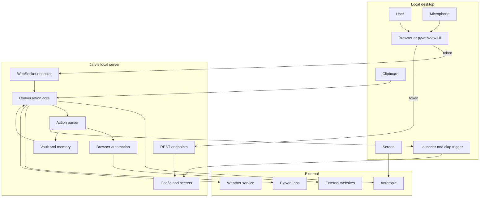

# Jarvis Voice Assistant – Threat Model

> Stand 2026-07-13, Commit `dd43a62`. Repository-gegründet; jede Architekturbehauptung
> trägt einen Evidence Anchor (repo-relativer Pfad + Symbol). Analyse-/Doku-Artefakt —
> **kein** Produktionscode geändert. Secrets werden nie ausgegeben (`[REDACTED]`).
>
> **Nachtrag 2026-07-19 (Code-Stand nach Phase 5C) — die folgende Analyse beschreibt den
> Stand vom 2026-07-13; einige technische Kontrollen sind inzwischen implementiert, die
> Risiken bleiben aber offen:**
> - **SSRF (TM-002):** Es gibt jetzt einen **Host-Denylist-`TargetGuard`** (Loopback, RFC1918,
>   Link-local, ULA, Metadata, Selbstzugriff `127.0.0.1:8340`) und **`follow_redirects=False`**
>   mit pro-Hop geprüfter Redirect-Kette plus Nachprüfung der verbundenen IP
>   (`capability/_ssrf.py`, `browser_tools.py`). Die unten stehenden Aussagen „kein Host-Filter"
>   und „`follow_redirects=True`" sind damit **überholt**. **TM-002 bleibt dennoch `high`:**
>   ohne IP-Pinning ist **DNS-Rebinding** weiterhin möglich (Phase 9). **Nicht behoben.**
> - **Untrusted → Aktion (TM-001):** Alle 22 Actions laufen über den reinen Policy Kernel;
>   `[ACTION:…]` ist immer `derived` und autorisiert nie eine `external-write`. Der frühere
>   direkte `execute_action`-Fallback existiert **nicht mehr**. **TM-001 bleibt dennoch `high`:**
>   flächendeckend *durchsetzbar*, aber untrusted Inhalt erreicht das Modell unverändert.
>   **Nicht gelöst.**
> - Maßgeblich für den aktuellen Mitigationsstatus ist `docs/security/RISK_REGISTER.md`.
>   Es werden **keine** neuen Sicherheitsversprechen gemacht.

## Executive summary

Jarvis ist ein **rein lokaler** Windows-Sprachassistent (FastAPI an `127.0.0.1`,
`server.py:746`), der untrusted Inhalte (Webseiten, Vault-Notizen, Clipboard,
Bildschirm) in einen LLM-Kontext zieht und aus der LLM-Antwort `[ACTION:…]`-Aktionen
ausführt. Die dominierenden Risikothemen sind daher **KI-spezifisch**: (1) **Prompt
Injection** aus untrusted Inhalt, die eine Aktion auslöst (TM-001); (2) **SSRF** über
die Browser-/HTTP-Navigation, die nur das URL-Schema, nicht den Host prüft (TM-002).
Beide sind **high**. Weitere mittlere Risiken: lokaler **Session-Token-Diebstahl** über
`GET /` (TM-003), **Voice-Spoofing** ohne Identitätsnachweis (TM-004), **Vollbild-**
und **Clipboard-Abfluss** in die Cloud ohne Vorschau (TM-005/006), **Klartext-Secrets**
in `config.json` (TM-007) und **persistente Memory-Injection** (TM-008). Es gibt **keine
Critical-Risiken**, weil die heutigen Wirkungen eng begrenzt sind: App-Start nur per
Allowlist ohne Shell (`app_launcher.py:471`), `OPEN` nur `http`/`https`
(`actions.py:171`), Löschen nur nach mündlicher Bestätigung (`actions.py:136`), kein
`external-write` und keine autonome Shell.

## Scope and assumptions

**In scope:** die aktuelle Jarvis-Runtime (FastAPI/WS, Browser-/pywebview-Frontend,
Voice-Flow, Anthropic/ElevenLabs/Wetter, Browserautomation, Screen, Clipboard,
Obsidian/Vault + Memory, Action-Parser/-Ausführung, App-/Prozessstart, Profile/Monitor,
Config/Secrets, lokale Logs, Launcher/Sessionstart). Tests/Dev-Werkzeuge sind **getrennt**
betrachtet. Geplante Capability-/Job-/Scheduler-/Connector-Runtime nur als **zukünftige**
Sicherheitsanforderung (nicht als vorhandene Kontrolle).

**Out of scope** (Auswirkung auf Priorisierung notiert): öffentliche Cloud-Bereitstellung,
Multi-Tenant, Mobile, autonome Shell, unbekannte Runtime-Plugins, autonome
Codeänderung, bereits kompromittierter Windows-Admin/Kernel, vollständiger Schutz gegen
Malware **mit denselben Benutzerrechten**. → Bedeutet nicht risikofrei: mehrere Threats
(TM-003, TM-007) setzen einen lokalen Prozess mit Benutzerrechten voraus; deren
Priorität ist entsprechend **gedämpft** (nicht critical), weil solcher Zugriff teils
außerhalb des Modells liegt, aber dokumentiert bleibt.

**Bestätigte (konservative) Annahmen** (Assumption-Gate, per Nutzer-Delegation adoptiert):
A1 nur lokaler Einzelbenutzer; A2 Wirkung nur bei entsperrtem lokalem Desktop; A3 Stimme
ist kein Identitätsnachweis; A4 untrusted Inhalt autorisiert nie; A5 `secret` nie an die
Cloud. Bei späterem Remote-Wunsch werden die davon abhängigen Schlüsse **conditional**.

**Open questions (rankingrelevant):** siehe Abschnitt „Open questions".

## System model

### Primary components

- **WS-Endpoint** — einzige interaktive Nachrichtenschnittstelle, Origin+Token-Gate
  (`server.py:102` `websocket_endpoint`).
- **REST-Endpoints** — Settings/Musik/Dashboard/Commands/Launcher, alle Token-gated
  (`server.py:236` `_settings_token_ok`); Ausnahmen `GET /health`, `GET /`, `/static`.
- **Conversation-Core** — System-Prompt, LLM-Aufruf, Action-Ausführung
  (`assistant_core.py:653` `process_message`, `:452` `execute_action`).
- **Action-Parser** — validiert untrusted LLM-Text (`actions.py:210` `parse_action`).
- **Browser-Automation** — Playwright + HTTP-Fallback (`browser_tools.py:293` `visit`,
  `:349` `open_url`, `:253` `fetch_page_text_fallback`).
- **Screen/Clipboard** — Vollbild-Capture (`screen_capture.py:11` `capture_screen`),
  Clipboard-Lesen (`clipboard_tools.py:14` `get_clipboard_text`).
- **Vault/Memory** — Obsidian-Zugriff, Kontext-Broker mit Secret-Filter
  (`memory.py` `get_project_context_sync`, `_SECRET_LINE_RE`).
- **App-Launcher** — Allowlist-Start ohne Shell (`app_launcher.py:479` `launch`,
  `:466`/`:471` `_start_url`/`_start_process`).
- **Config/Secrets** — Laden/Validieren/Speichern (`config_loader.py:16` `REQUIRED_KEYS`,
  `:35` `PROTECTED_KEYS`), API-Keys Klartext in `config.json`.
- **Launcher/Clap** — pywebview-Fenster + Doppelklatschen-Trigger
  (`jarvis-launcher.pyw`, `scripts/clap-trigger.py`, `scripts/launch-session.ps1`).

### Data flows and trust boundaries

- Mikrofon → Browser/OS-Speech → Frontend: Audio→Text; Web Speech API; keine Auth;
  Validierung erst serverseitig. Evidence: `frontend/main.js`.
- Frontend → lokaler WS: Text/Stop; WS über `127.0.0.1`; Auth = Origin + Session-Token;
  keine Schema-Validierung außer `text`/`type`. Evidence: `server.py:102`.
- Frontend → REST: Settings/Launcher-Befehle; HTTP `127.0.0.1`; Auth = `X-Jarvis-Token`;
  Whitelist-Validierung (`config_loader.validate_settings_update`). Evidence:
  `server.py:294`, `config_loader.py:316`.
- Ausgelieferte Seite → Session-Token: Token als JS-Global in `GET /` injiziert; Schutz
  nur Same-Origin (greift nicht gegen lokale Nicht-Browser-Clients). Evidence:
  `server.py:723` `serve_index`.
- Server → Anthropic/ElevenLabs/Wetter: Prompt/Text/Stadt über TLS; Auth = API-Key;
  keine lokale Rate-Begrenzung außer Timeouts. Evidence: `assistant_core.py:682`,
  `tts.py`, `assistant_core.py:105`.
- Server → externe Websites: URL-Navigation; nur Schema http/https geprüft, **kein
  Host-Filter**, `follow_redirects=True`. Evidence: `actions.py:171` `normalize_url`,
  `browser_tools.py:271`.
- Bildschirm → Vision: gesamter Screen als PNG → Anthropic; kein Scope/Preview/Filter.
  Evidence: `screen_capture.py:13`.
- Clipboard → LLM: voller Clipboard-Text (≤4000) → LLM; kein Preview/Filter. Evidence:
  `clipboard_tools.py:14`.
- Vault/Clipboard/Web/Screen-Inhalt → LLM-Kontext: untrusted Inhalt als Modell-Input;
  keine Trennung von Instruktion vs. Daten. Evidence: `assistant_core.py:192`, `:630`.
- LLM-Ausgabe → `[ACTION:…]`-Parser: validierter Typ/Payload/URL. Evidence:
  `actions.py:210`.
- Action → Dateisystem/Browser/Prozess/Config: Vault-Schreiben, Navigation,
  Allowlist-App-Start, `config.json`-Schreiben. Evidence: `memory.py`, `browser_tools.py`,
  `app_launcher.py:479`, `config_loader.py:352` `save_settings`.
- Launcher → PowerShell/Win32/pywebview: Sessionstart + Fenster-Snapping. Evidence:
  `scripts/launch-session.ps1`, `jarvis-launcher.pyw`.
- **Zukünftig:** Jarvis → Produktivitäts-Connectoren (Kalender/Mail): **noch nicht
  implementiert** → als zukünftige Trust Boundary geführt (Phase 10).

#### Diagram

## Assets and security objectives

| Asset | Why it matters | Objective (C/I/A) |
|---|---|---|
| Anthropic/ElevenLabs API-Keys | Kostenmissbrauch, Kontoübernahme bei Diebstahl | C, I |
| Session-Token | Autorisiert alle REST/WS-Wirkungen | C, I |
| `config.json` (persönlich) | Persona, Pfade, Apps, Secrets | C, I |
| Conversation-History | Private Gesprächsinhalte | C |
| Screen-Inhalte | Potenziell Passwörter/vertrauliche Dokumente | C |
| Clipboard-Inhalte | Potenziell kopierte Secrets | C |
| Vault-/Memory-Daten | Persönliche Notizen, Langzeitwissen | C, I |
| Inbox-Notizen | Tagesnotizen | C, I |
| App-Allowlist / Launcher-Profile | Was gestartet/platziert wird (Integrität!) | I |
| Externe Zieladressen (Navigation) | SSRF-Hebel, Datenabfluss | I |
| Audit-/Diagnose-Info | Nachvollziehbarkeit | I, A |
| Verfügbarkeit Mikro/Browser/Server | Grundfunktion | A |
| Integrität zukünftiger Jobs/Connector-Wirkungen | Doppelte/ungewollte externe Wirkung | I (zukünftig) |

## Attacker model

### Capabilities

- Kontrolliert eine besuchte Website oder platziert bösartigen Inhalt auf einer
  legitimen Seite / in einer Recherchequelle.
- Platziert manipulierten Text in einer Vault-Notiz, im Clipboard oder sichtbar auf dem
  Bildschirm (Prompt-Injection-Text).
- Erzeugt Audio in Mikrofonreichweite (fremde Stimme, Lautsprecher, Meeting, Aufnahme).
- Läuft als **lokaler Prozess mit normalen Benutzerrechten** (kann `GET /` abrufen).
- Kompromittierter externer Provider oder manipulierte Abhängigkeits-/Skill-Quelle.
- Legitimer Nutzer mit Fehlbedienung.

### Non-capabilities

- Kein Windows-Admin/Kernel, kein bereits kompromittiertes Betriebssystem.
- Kein Netzwerkzugriff aus dem LAN auf den Server (nur `127.0.0.1`, `server.py:746`).
- Keine autonome Shell-Ausführung aus Modellantworten (App-Start nur Allowlist).
- Kein `external-write` (E-Mail/Kalender) — heute nicht implementiert.
- Kein Umgehen der mündlichen Bestätigung für `MEMORY_FORGET`.

## Entry points and attack surfaces

| Surface | How reached | Trust boundary | Notes | Evidence |
|---|---|---|---|---|
| WS `/ws` | Frontend/pywebview | Frontend→WS | Origin+Token; `text`/`stop` | `server.py:102` |
| `GET /` | jeder lokale Client | Seite→Token | **unauth; injiziert Token** | `server.py:723` |
| `GET /health` | jeder lokale Client | Frontend→REST | unauth, passiv | `server.py:220` |
| `POST /settings` u.a. | Frontend | Frontend→Config | Token + Whitelist | `server.py:294` |
| Voice-Text | Mikrofon→Speech→WS | Mikro→Browser | keine Identität | `frontend/main.js` |
| LLM-Ausgabe | Anthropic→Parser | LLM→Parser | validiert | `actions.py:210` |
| URL-Navigation | BROWSE/OPEN/RESEARCH | Action→Web | nur Schema geprüft | `browser_tools.py:293` |
| Screen | SCREEN-Action | Screen→Vision | Vollbild→Cloud | `screen_capture.py:13` |
| Clipboard | CLIPBOARD-Action | Clipboard→LLM | voll→Cloud | `clipboard_tools.py:14` |
| Vault/Memory | INBOX/MEMORY/PROJECT_CONTEXT | Vault→Core | Secret-Filter (Context) | `memory.py` |
| App-Start | APP_OPEN / UI | Action→Prozess | Allowlist, kein Shell | `app_launcher.py:479` |
| Clap-Trigger | Doppelklatschen | Mikro→Launcher | unauth Session-Start | `scripts/clap-trigger.py` |

## Top abuse paths

1. **Prompt-Injection → Aktion:** Angreifer platziert Text auf einer Seite → `RESEARCH`/
   `BROWSE` liest ihn → LLM-Kontext → LLM emittiert `[ACTION:OPEN]`/`[ACTION:INBOX_WRITE]`
   → Aktion läuft. Impact: SSRF/Datenschreiben/Spam. (TM-001)
2. **SSRF via Redirect:** Angreifer-URL (oder injizierte URL) → `visit`/HTTP-Fallback mit
   `follow_redirects=True` → interne/Loopback-Adresse → interner Inhalt in die
   LLM-Zusammenfassung. (TM-002)
3. **Lokaler Token-Diebstahl:** lokaler Prozess `GET /` → liest `window.JARVIS_TOKEN` →
   ändert `config.apps`-Allowlist per `POST /settings` → `POST /commands/app/open` startet
   den nun manipulierten Eintrag. (TM-003 + Amplifikation)
4. **Voice-Spoofing:** Lautsprecher/fremde Stimme sagt „öffne …/recherchiere …/notiere …"
   → Aktion ohne Identitätsprüfung. (TM-004)
5. **Screen-Exfiltration:** injizierte/gespoofte Anweisung `SCREEN` → Vollbild (inkl.
   fremder Fenster/Passwörter) → Anthropic-Cloud. (TM-005)
6. **Clipboard-Exfiltration:** `CLIPBOARD` liest kopiertes Secret → Cloud. (TM-006)
7. **Persistente Memory-Injection:** manipulierte Vault-Notiz oder erzwungenes
   `MEMORY_WRITE` → fließt künftig in den System-Prompt → dauerhafte Beeinflussung.
   (TM-008)
8. **Secret-Diebstahl aus Config:** lokaler Prozess/Backup liest `config.json` →
   Klartext-API-Keys. (TM-007)

## Threat model table

| Threat ID | Threat source | Prerequisites | Threat action | Impact | Impacted assets | Existing controls (evidence) | Gaps | Recommended mitigations | Detection ideas | Likelihood | Impact severity | Priority |
|---|---|---|---|---|---|---|---|---|---|---|---|---|
| TM-001 | Untrusted Web-/Vault-/Clipboard-/Screen-Inhalt | Nutzer löst SEARCH/BROWSE/RESEARCH/SCREEN/CLIPBOARD aus | Injizierter Text bringt LLM dazu, `[ACTION:…]` zu emittieren | Ungewollte Navigation/Schreibvorgänge/App-Start | History, Vault, Allowlist, ext. Ziele | `parse_action` validiert Typ/Payload/URL (`actions.py:210`); Allowlist (`app_launcher.py:479`); OPEN http/https (`actions.py:171`); FORGET confirm (`actions.py:136`) | Keine Trennung Instruktion/Daten; untrusted Inhalt kann Aktion beeinflussen | Untrusted-Content-Isolation; Aktionen nie aus untrusted Text autorisieren; Wirkungsklassen-Policy (Phase 5); Preview für wirkende Aktionen | Log je Aktion mit Quelle; anomale Aktionsraten | high | medium | **high** |
| TM-002 | Bösartige/umgeleitete URL | RESEARCH/BROWSE/OPEN mit angreiferbeeinflusster URL | Navigation zu Loopback/RFC1918/Link-Local/Metadata; Redirect | Zugriff auf interne Dienste (inkl. `127.0.0.1:8340`), Datenabfluss in Zusammenfassung | Ext. Ziele, interne Dienste | Nur http/https (`actions.py:171`); Größen-Cap (`browser_tools.py:233`); Timeout | **Kein Host-Filter** (loopback/privat/metadata); `follow_redirects=True` (`browser_tools.py:271`) | Host-Denylist (loopback/RFC1918/169.254/::1/fc00::/7/metadata); Redirect-Ziel re-validieren; DNS-Rebinding-Schutz | Log der Zielhosts; Alarm bei privaten IPs | medium | high | **high** |
| TM-003 | Lokaler Prozess (Benutzerrechte) | Code-Ausführung als Nutzer | `GET /` liest `window.JARVIS_TOKEN`; nutzt REST/WS | Volle Jarvis-Steuerung, Config-Manipulation | Session-Token, Config, Allowlist | Token gated REST/WS (`server.py:236`); Bind 127.0.0.1 (`:746`) | Token in unauth `GET /` lesbar (`server.py:723`); Same-Origin schützt nicht lokale Nicht-Browser | Token nicht in HTML einbetten (z.B. lokaler Handshake/Nonce pro Fenster); Origin/`Sec-Fetch` prüfen; künftig UI-Bestätigung für Hochrisiko | Log unerwarteter Clients; mehrfache `GET /` | low | high | **medium** |
| TM-004 | Audioquelle in Mikroreichweite | Mikro aktiv, Nutzer evtl. abwesend | Fremde/aufgezeichnete Stimme gibt Sprachbefehl | Ungewollte Aktionen ohne Identität | Alle Wirkungen | FORGET confirm (`actions.py:136`); Aktionen heute begrenzt | Voice = trusted; keine Präsenz-/Identitätsbindung | „Voice ist kein Identitätsnachweis"; Hochrisiko/destruktiv/external-write nur mit UI-Bestätigung; Push-to-Talk-Option | Log Aktivierungen; unplausible Zeiten | medium | medium | **medium** |
| TM-005 | Injizierte/gespoofte SCREEN-Auslösung | SCREEN ausgelöst | Vollbild (alle Inhalte) → Vision-Cloud | Abfluss sichtbarer Secrets/Docs | Screen-Inhalte | — | Kein Scope/Region/Preview/Filter (`screen_capture.py:13`) | Region statt Vollbild; sichtbare Übertragungsvorschau; Secret-Filter; Datenklasse `sensitive` | Log SCREEN-Nutzung | medium | medium | **medium** |
| TM-006 | Injizierte/gespoofte CLIPBOARD-Auslösung | CLIPBOARD ausgelöst | Kopiertes Secret → LLM-Cloud | Abfluss kopierter Secrets | Clipboard-Inhalte | Cap 4000, fixes Kommando (kein Injection) (`clipboard_tools.py`) | Kein Preview/Secret-Filter | Übertragungsvorschau; Secret-Muster-Filter; `sensitive`-Regeln | Log CLIPBOARD-Nutzung | medium | medium | **medium** |
| TM-007 | Lokaler Prozess / Backup / Sync | Lesezugriff auf `config.json` | Klartext-API-Keys auslesen | Kostenmissbrauch, Kontomissbrauch | API-Keys | Gitignored; `PROTECTED_KEYS` nie über API (`config_loader.py:35`); Werte nie geloggt | Klartext at rest; kein DPAPI | Windows Credential Manager/DPAPI (siehe CREDENTIAL_STRATEGY); Rotation | Zugriffs-Audit (OS) | low | medium | **medium** |
| TM-008 | Manipulierte Vault-Notiz / erzwungenes MEMORY_WRITE | Schreibzugriff auf Vault oder Injection | Persistenter Text fließt in System-Prompt | Dauerhafte Modellbeeinflussung | Memory/Vault | MEMORY_WRITE nur explizit; FORGET confirm | Vault/Memory untrusted im Prompt | Memory als untrusted markieren; Review-Inbox für Auto-Extraktion (Phase 7); Provenienz | Diff der Memory-Datei | low | medium | **medium** |
| TM-009 | Kompromittierter Provider / Dependency / Skill-Quelle | Bezug einer manipulierten Quelle | Datenabfluss oder Verhaltensmanipulation | Vertraulichkeit/Integrität | Prompts, Secrets, Verhalten | `skills-lock.json`-Hashes; Skills geprüft (Phase 0/2); Provider TLS | Keine Dependency-Pins mit Hash; Skills = **Dev-Tooling**, laufen mit vollen Rechten | Dependency-Pinning/Hashes; Skill-Review-Prozess (bereits genutzt); Runtime/Dev trennen | Lockfile-Diff; Netzwerk-Anomalien | low | medium | **low** |
| TM-010 | Nutzer/Injection erzeugt Last | Wiederholte Aktionen | Ressourcen-/Tab-/Download-Flut | Lokale DoS | Verfügbarkeit | MAX_TABS=5 (`browser_tools.py:18`); MAX_HISTORY=60; Download-Cap; Timeouts; Stop | Kein globales Budget je Workflow | Zeit-/Kosten-/Call-Budgets je Workflow (Phase 6/11) | Metriken Queue/Dauer | low | low | **low** |

## Criticality calibration

Für **diesen** Kontext (lokal, Einzelnutzer, kein Public-Exposure, keine external-write):
- **critical:** würde einen Remote-/Pre-Auth-Kompromiss, Diebstahl von Secrets *ohne*
  lokalen Zugriff oder autonome destruktive external-write-Wirkung bedeuten — **existiert
  aktuell nicht**.
- **high:** untrusted Inhalt löst eine Wirkung aus (TM-001); SSRF in interne Dienste
  (TM-002). Kennzeichen: kein lokaler Vorabzugriff nötig, reale Alltagsauslöser.
- **medium:** benötigt lokalen Prozess (TM-003/007), physische Audio-Nähe (TM-004) oder
  begrenzten Datenabfluss (TM-005/006/008).
- **low:** Voraussetzungen unwahrscheinlich oder Wirkung klein/leicht behebbar
  (TM-009/010).

## Focus paths for security review

| Path | Why it matters | Related Threat IDs |
|---|---|---|
| `actions.py` (`parse_action`, `normalize_url`) | Einzige Validierung untrusted LLM-Ausgabe + URL-Policy | TM-001, TM-002 |
| `browser_tools.py` (`visit`, `open_url`, `fetch_page_text_fallback`) | SSRF-Oberfläche, Redirects | TM-002 |
| `assistant_core.py` (`execute_action`, `build_system_prompt`, `run_action_and_respond`) | Untrusted-Inhalt→Aktion, Prompt-Zusammenbau | TM-001, TM-008 |
| `server.py` (`serve_index`, `_settings_token_ok`, `websocket_endpoint`) | Token-Ausgabe + Autorisierung | TM-003 |
| `screen_capture.py`, `clipboard_tools.py` | Sensitiver Cloud-Abfluss | TM-005, TM-006 |
| `config_loader.py` (`save_settings`, `PROTECTED_KEYS`) | Secret-Handling, Config-Schreiben | TM-007, TM-003 |
| `memory.py` (`get_project_context_sync`, Secret-Filter) | Vault-Untrusted, Secret-Filter-Abdeckung | TM-008 |

## Accepted and unacceptable residual risks

- **Akzeptiert (dokumentiert):** Malware mit denselben Benutzerrechten kann Screen/
  Clipboard/Config ohnehin lesen — TM-003/007 sind dadurch teils out-of-scope; bleiben
  aber wegen der Token-Fehlannahme dokumentiert. Clap-Trigger startet nur die
  nutzer­eigene Session (geringe Wirkung).
- **Nicht akzeptabel ohne Behandlung:** TM-001 und TM-002 (high) — brauchen konkrete
  Mitigation + Zielphase + Gate (siehe RISK_REGISTER). Ein High darf nicht still
  akzeptiert werden.

## Open questions

- Soll SSRF-Schutz auch **Zugriffe auf `127.0.0.1:8340`** (Selbstzugriff) hart blocken?
  (Empfehlung: ja.) — beeinflusst TM-002/003.
- Ist eine **Push-to-Talk-Pflicht** für wirkende Aktionen akzeptabel (gegen Voice-
  Spoofing)? — beeinflusst TM-004.
- Soll Screen-Capture künftig **nur aktives Fenster/Region** statt Vollbild? — TM-005.
- Datenklasse-Taxonomie für die Metadaten des kommenden Capability-Kernels (Phase 5) —
  offen bis Umsetzung.

## Quality check

- [x] Alle Entry Points erfasst (WS, REST, `/`, `/health`, Voice, LLM-Ausgabe, URL,
  Screen, Clipboard, Vault, App-Start, Clap).
- [x] Jede Trust Boundary in ≥1 Abuse Path/Threat (Kanten 1–21; Kante 21 als zukünftig).
- [x] Runtime vs. Tests/Dev getrennt (TM-009 markiert Skills als Dev-Tooling).
- [x] Nutzerannahmen (A1–A5) als konservativ adoptiert + `conditional` markiert.
- [x] Assumptions/Open questions sichtbar.
- [x] Threat IDs stabil (TM-001…TM-010), keine Dubletten.
- [x] Jeder High-Threat (TM-001/002) mit konkreter Mitigation + Zielphase (RISK_REGISTER).
- [x] Keine Secrets/persönlichen Werte im Dokument.
